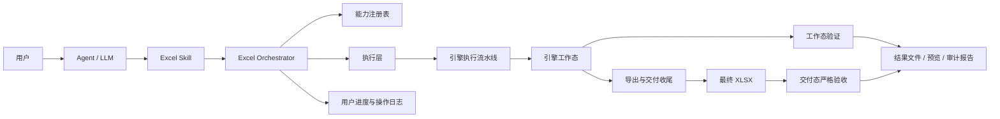
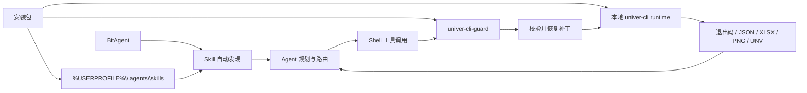
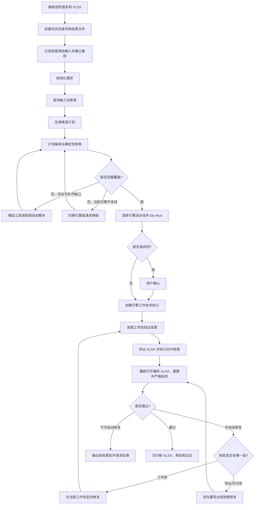

# 整体架构设计

## 1. 背景与目标

系统面向经营报表、已有 Excel 修改和财务模型三类场景，为 Agent 提供可复用、可扩展、可审计的 Excel 执行能力。

系统需要同时解决两个相互冲突的问题：

1. 固定脚本稳定但泛化不足。
2. LLM 动态生成脚本灵活但风险和不确定性较高。

因此系统采用“固定能力优先、动态能力兜底、统一严格验收”的混合架构。

## 2. 设计目标

- 用户通过自然语言描述任务，无需了解底层库或 Excel API。
- 高频任务能够稳定复用，不反复生成相同代码。
- 非模板需求可以由多个脚本和原子工具组合完成。
- 只有现有能力存在明确缺口时，才生成动态脚本。
- 默认不覆盖原文件，所有修改在工作副本上执行。
- 高风险操作必须在执行前向用户说明并确认。
- 用户可以看到分析、规划、执行、返修和验收过程。
- 系统必须验证实际工作簿，不能以 Agent 自报成功作为完成依据。
- 底层引擎可替换，避免业务能力绑定单一实现。
- 明确区分原始输入、引擎工作态和最终交付态，并分别验证。

## 3. 非目标

MVP 阶段不承诺：

- 无条件保留任意复杂 Excel 文件中的所有高级对象。
- 自动完成任意 Power Query、DAX、VBA 或数据模型任务。
- 在没有业务规则的情况下证明所有财务结果正确。
- 高并发、无人值守地批量控制桌面 Excel。
- 用固定模板结果证明系统具备通用复杂表格能力。

## 4. 设计原则

### 4.1 能力显式化

每个模板、任务脚本、原子工具和引擎都必须声明输入、输出、能力、参数、限制、风险和验收方式。Planner 不通过读取脚本名称猜测能力。

### 4.2 确定性优先

执行优先级固定为：

```text
单模板
  -> 模板 + 原子工具
  -> 多任务脚本组合
  -> 纯原子工具组合
  -> 固定能力 + 局部动态脚本
  -> 完整动态脚本
```

### 4.3 最小动态代码

如果现有能力已覆盖 90% 的任务，动态脚本只补齐剩余 10%，不得重新实现整项任务。

### 4.4 原文件不可变

输入文件作为只读证据保存。系统创建工作副本，并将最终结果保存到新的输出路径。

### 4.5 验收独立

执行模块和验收模块分离。执行器不能自行给出最终 PASS；Validator 必须重新打开输出文件并独立检查。

### 4.6 可解释与可追踪

每项需求必须能追踪到计划步骤、工具调用、工作簿变更和验收规则。

### 4.7 真实输入优先

用户提供的 XLSX 是输入事实源。任务级模板不得用合成数据或固定骨架替代真实输入；模板只能在声明的映射和保留规则内扩展工作簿。

### 4.8 工作态与交付态分离

引擎工作态用于持续修改，例如 Univer 的 `.unv` 或 COM 会话；最终 XLSX 是独立交付态。两者必须分别读取和验证，不能用工作台预览代替导出文件验收。

## 5. 系统上下文



### 5.1 Agent 接入上下文

迁移版 Univer 证明了一条低侵入接入方式：BitAgent 不直接链接表格引擎，而是从 Skill 目录发现能力，再通过 Shell 调用受保护的本地 CLI。



这种方式不是 MCP，也不是 BitAgent 原生插件。它的优势是接入成本低、现有 Skill 可直接控制工作流；限制是参数约束、权限控制和结构化错误主要依赖 CLI 自身，BitAgent 只能通过进程边界观察结果。

## 6. 逻辑组件

### 6.1 Excel Skill

负责定义 Agent 的操作规程：

- 何时触发 Excel 能力。
- 先检查、后规划、再执行的顺序。
- 模板推荐和用户选择规则。
- 高风险操作确认规则。
- 禁止覆盖原文件。
- 动态脚本启用条件。
- 严格验收和交付要求。

Skill 不直接承担底层文件操作。

在 BitAgent 中，Skill 默认安装到 `%USERPROFILE%\.agents\skills\<skill-name>\SKILL.md`。BitAgent 重启后重新发现 Skill。Skill 中引用的脚本和 CLI 路径必须在安装时改写为当前机器的实际路径，不能保留打包机器的绝对路径。

### 6.2 Workbook Inspector

以只读方式提取：

- 工作表、命名范围、表格对象和使用区域。
- 表头、样本数据、数据类型和空值情况。
- 公式、外部引用、图表和条件格式。
- 宏、Power Query、数据模型、透视表和切片器等风险对象。
- 文件指纹和复杂度分级。

### 6.3 Requirement Normalizer

将自然语言需求转换为结构化需求，包括：

- 目标、指标、维度和计算逻辑。
- 输入字段与字段映射。
- 目标工作表、布局和图表要求。
- 保真、性能、输出和验收约束。
- 需要用户确认的歧义。

### 6.4 Capability Registry

集中登记模板、脚本、原子工具、动态 SDK 和引擎能力。它是判断“现有脚本是否够用”的权威来源。

### 6.5 Planner 与 Plan Compiler

Planner 生成候选方案，Plan Compiler 负责：

- 计算需求覆盖率。
- 匹配工具参数和限制。
- 检查步骤输入输出兼容性。
- 生成有向无环依赖图。
- 计算风险、成本、保真度和可验收性。
- 选择最优方案。

### 6.6 Policy and Risk Gate

检查：

- 是否覆盖原文件。
- 是否删除工作表或大量单元格。
- 是否修改已有公式或高级对象。
- 是否运行宏、外部连接或动态代码。
- 是否超出批准目录和依赖范围。

高风险计划必须暂停并请求用户确认。

### 6.7 Executor

按照执行计划调用：

- 任务级脚本。
- 原子工具。
- 动态脚本运行器。
- 工作簿引擎。

执行器负责事务边界、超时、错误分类、重试和工作副本管理。

### 6.8 Engine Pipeline Adapter

通过统一任务契约访问 openpyxl、Windows COM 或 Univer，但允许每个引擎保留自己的正确执行流程：

- openpyxl：复制 XLSX -> 直接修改副本 -> 保存 -> 外部重算/渲染。
- Windows COM：复制 XLSX -> 打开 Excel 会话 -> 修改/重算 -> 另存为 -> 关闭会话。
- Univer：导入 XLSX -> `.unv` 工作包 -> 检查/运行脚本 -> 导出 XLSX -> 导出收尾。

上层统一的是输入、输出、能力、变更和验收契约，不要求所有引擎伪装成完全相同的底层 API。

### 6.9 Import/Export and Finalization

导入器负责把真实输入转换为引擎工作态，并生成导入基线；导出器负责生成最终 XLSX。Finalizer 可以修复导出物中的可确定问题，例如图表缓存和 OOXML 关系，但任何修复都会产生新的文件版本，并触发后续重新验收。

### 6.10 Validator

默认执行严格验收：

1. 文件完整性检查。
2. 工作簿结构检查。
3. 公式与引用检查。
4. 业务勾稽检查。
5. Excel 重算或替代重算检查。
6. 图表和高级对象检查。
7. 渲染与视觉检查。
8. 用户需求覆盖检查。

工作态验证确认修改已真实写入引擎；交付态验证重新打开最终 XLSX，确认导入、编辑、导出和收尾没有造成语义或结构损失。

### 6.11 Artifact and Event Manager

统一管理输入文件、工作副本、最终文件、预览、计划、脚本、日志和审计报告，并产生面向用户的实时事件。

## 7. 核心执行流程



## 8. 执行策略

### 8.1 模板策略

模板用于高频、结构稳定的业务任务。模板必须暴露参数和限制，用户可以显式选择，系统也可以推荐，但必须告知用户实际采用了模板。

### 8.2 任务级脚本策略

任务级脚本完成具有稳定业务含义的流程，例如标准经营报表、预算对比和基础财务模型。它可以组合原子工具，但不得绕过统一日志和验收。

### 8.3 原子工具策略

原子工具处理通用操作，例如范围读写、公式、格式、工作表、表格和图表。工具接口必须幂等或声明非幂等性。

### 8.4 动态脚本策略

动态脚本仅用于已识别的能力缺口，并优先生成局部补丁。脚本语言和可用 API 由选定引擎决定，例如 Univer 使用一个有界 JavaScript `run` 脚本，openpyxl 路线使用受控 Python SDK。脚本必须经过静态检查、受限运行和执行后审计。

### 8.5 真实输入与新建任务路由

```text
用户提供 XLSX/CSV
  -> 必须从 import/open-copy 开始
  -> 保留原始行、公式、工作表和业务语义
  -> 禁止用合成报表生成器替代输入

用户未提供输入且命中成熟报表能力
  -> 可调用任务级生成脚本

用户未提供输入且不命中成熟能力
  -> 原子能力组合或有界动态脚本
```

### 8.6 有界执行原则

同一引擎会话默认执行“一次建工作态、一次主编辑、一次导出、一次收尾”。执行失败时优先在当前工作态上定向修复，不反复回到原文件重新导入，也不生成大量 `step1/step2` 临时脚本。

## 9. 可观测性和用户体验

向用户显示面向业务的进度事件：

```text
正在分析工作簿结构
发现 6 张工作表、142 个公式和 3 张图表
推荐使用“经营分析”模板，并补充 2 个自定义指标
计划新增“经营总览”和“检查”工作表
等待确认：将修改 860 个单元格，不覆盖原文件
正在生成公式和图表
正在重新计算并检查财务勾稽关系
视觉检查发现标题截断，正在自动调整列宽
验收通过，已生成结果文件和审计报告
```

同时写入机器可读的 JSONL 事件流，供复盘和评测使用。

## 10. 建议的部署视图

```text
Agent Host
├── BitAgent
│   ├── Skill Discovery
│   ├── LLM Planner
│   └── Shell Tool
├── Excel Skill Package
│   ├── SKILL.md
│   ├── references/
│   └── maintained scripts/
├── Excel Orchestrator
├── Capability Registry
├── Script/Tool Runtime
├── Validation Runtime
├── Engine Pipeline Adapters
│   ├── openpyxl file pipeline
│   ├── COM session pipeline (optional)
│   └── Univer import/run/export pipeline (optional)
├── Export Finalizers
│   └── XLSX OOXML/chart finalizer (when required)
├── CLI Guard / Launcher
│   ├── runtime integrity check
│   ├── patch restore
│   └── process cleanup
└── Per-task Workspace
```

动态脚本运行环境应与 Agent 主进程隔离。COM 引擎若启用，应由专门的单任务 Worker 管理 Excel 进程和文件锁。

MVP 可以像迁移版一样先采用 Skill + CLI 接入，不必为了形式完整先开发 MCP。CLI 必须提供稳定的命令参数、非零失败退出码、JSON 结果、明确的文件产物和可独立执行的验证命令。后续需要更强参数校验、权限隔离、并发管理和远程部署时，再在 CLI 外增加 MCP 或服务层。

## 11. MVP 范围

- 支持 `.xlsx` 输入和输出。
- 2 个经营报表模板。
- 1 个基础财务模型模板。
- 10 至 15 个通用原子工具。
- 模板、工具和引擎能力注册表。
- 轻量规则路由、Dry Run 和用户确认；复杂候选计划评分延后。
- 受控动态 Python 脚本。
- 原文件只读、工作副本执行、统一另存为。
- 输入基线、工作态验证，以及最终 XLSX 的结构、公式、业务和视觉验收。
- 用户进度事件和完整操作日志。
- 检测高级 Excel 对象并阻止不安全处理。

## 12. 演进路线

### 阶段一：演示闭环

完成自然语言、能力路由、工作副本执行、严格验收和可见进度。

### 阶段二：提高开放任务覆盖率

扩充原子工具，积累动态脚本案例，将高频动态逻辑沉淀为正式工具。

### 阶段三：高保真引擎

根据实际文件需求接入 Windows COM，并建立高级对象兼容矩阵。

### 阶段四：产品化

增加版本管理、回滚、权限、并发调度、评测体系和生产监控。
