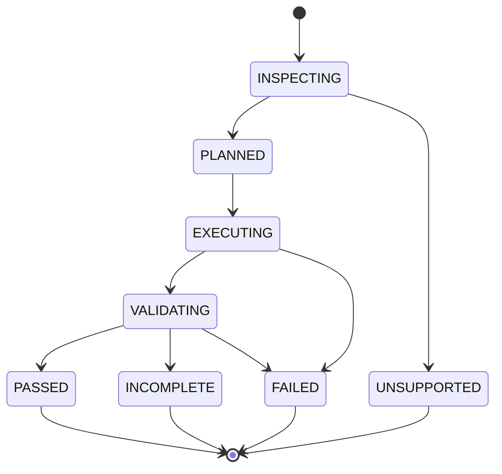

# Excel Agent MVP 架构设计 V2

## 1. 文档目的

本文先审查现有整体设计和详细设计中的重大问题，再给出一套可以直接进入开发的 MVP 架构。

MVP 的目标不是证明系统能够处理任意 Excel 请求，而是证明一条可信的最小闭环：Agent 能检查真实 XLSX、生成确定性计划、在副本上完成一类受支持的修改，并用独立证据判断交付物是否合格。

## 2. 现有设计的重大问题

### 2.1 MVP 与目标态架构混在一起

现有主链路同时包含 Requirement Normalizer、Capability Registry、Planner、Plan Compiler、Policy Gate、多引擎 Pipeline、动态脚本沙箱、Finalizer、视觉验收和自动返修。每个组件单独看都有价值，但它们共同出现时，MVP 实际上已经接近一个平台产品。

后果：

- 无法判断第一条端到端链路最少需要实现哪些模块。
- 任何功能都依赖尚未实现的上游抽象。
- 团队容易先建设注册表、评分器和沙箱，而不是先验证 Excel 修改是否可靠。

### 2.2 关键技术决策未关闭

详细设计结束时，主引擎、重算/渲染方案、动态脚本隔离方式、COM 和 Univer 是否进入 MVP 仍是待定项。这些不是局部实现细节，而是决定部署环境、文件保真、错误语义和测试方法的一级决策。

后果：接口虽然抽象，但无法据此估算、编码或定义真正的 PASS。

### 2.3 首期范围过宽且验收目标互相牵制

现有 MVP 同时要求三类模板、10 至 15 个原子工具、局部动态脚本、严格结构/公式/业务/视觉验收、自动拦截公式与视觉错误，还要求高级对象保护。对首个版本而言，这不是一个最小验证面。

其中财务模型尤其会强制引入公式重算和业务勾稽；视觉错误自动修复又会引入渲染器和视觉判断。它们会掩盖最核心的问题：输入是否被正确理解、修改是否受控、输出是否没有意外损坏。

### 2.4 自然语言职责边界不清

系统既依赖外层 Agent/LLM，又设计了内部 Requirement Normalizer 和 Planner，但没有定义：

- 哪一层负责从自然语言生成结构化任务。
- 结构化结果由谁校验、失败后由谁追问。
- LLM 输出是否能直接进入执行器。
- 同一输入是否要求生成可复现的计划。

如果 CLI 再内置一次 LLM 规划，会形成“双规划器”，问题难以复现，评测也无法区分理解错误和执行错误。

### 2.5 动态脚本安全模型只有原则，没有可实现边界

文档要求禁止网络、子进程、动态导入、环境变量遍历，并限制文件系统、依赖、内存和输出大小；但普通 Python 进程内的 `openpyxl` SDK 包装不能提供这种安全隔离。静态检查也不能可靠证明任意 Python 安全。

因此，“MVP 支持受控动态 Python 脚本”和“具备严格安全边界”不能同时成立，除非额外引入容器、低权限进程或专用解释器。现有设计没有选定其中一种。

### 2.6 多引擎抽象早于第二个可工作的引擎

`WorkbookPipeline` 同时容纳文件型、Excel 会话型和 Univer 工作包型引擎，接口不得不包含 prepare、import verification、export 和 finalize 等所有路线的并集。

这会产生推测性抽象。没有两个通过契约测试的实现前，无法知道统一边界是否正确。MVP 只需保留可替换点，不需要实现引擎路由和完整能力矩阵。

### 2.7 “严格验收”缺少明确的结果语义

现有设计正确指出 `openpyxl` 不计算公式，但没有把这一限制落实为统一结果模型。例如缺少以下明确规则：

- 无重算器时，公式任务能否成功。
- 视觉渲染不可用时，是否允许 PASS。
- WARN、FAIL、未执行和不适用如何区分。
- 哪些检查是每个任务的阻断项。

如果检查缺失仍给出 PASS，“严格验收”就只是名称；如果任何可选检查缺失都 FAIL，MVP 又无法运行。

### 2.8 变更控制停留在执行器自报

设计定义了 `ChangeSet`，但没有明确用输入和输出的独立差异来核对声明。执行器可能漏报修改，保存过程也可能改变未声明对象。

真正的受控修改需要三份证据：计划声明、执行器记录、Validator 独立生成的前后差异。三者不一致时必须失败。

### 2.9 高级对象“检测后阻止”缺少检测能力边界

宏容易通过扩展名或 VBA 部件识别，但 Power Query、数据模型、外部连接、切片器、复杂透视表和第三方扩展并不能仅靠 `openpyxl` 对象模型完整发现。文档当前容易让人误以为可以证明文件安全。

MVP 应采用 OOXML 部件和关系的拒绝列表，并明确这是保守筛查，不是完整兼容性证明。遇到未知扩展部件应拒绝，而不是尝试保存。

### 2.10 缺少纵向可交付切片

现有阶段按“演示闭环、开放覆盖、高保真、产品化”描述，但第一阶段仍包含几乎全部系统角色。缺少按可运行增量拆分的顺序，例如：检查 -> 计划 -> 单项修改 -> 独立差异 -> 公式重算 -> Agent 接入。

## 3. MVP 设计决策

| 决策项 | MVP 决策 | 理由 |
|---|---|---|
| 产品入口 | BitAgent Skill + 本地 CLI | 沿用已验证的低侵入接入方式 |
| 自然语言处理 | 由 Agent 完成，CLI 只接收结构化任务 | 避免双规划器，保证执行可复现 |
| 文件格式 | 仅 `.xlsx`，拒绝 `.xlsm`、`.xlsb`、`.xls` | 缩小保真和安全风险 |
| 执行引擎 | `openpyxl` 单引擎 | 依赖轻、易测试，足以验证普通工作簿闭环 |
| 支持对象 | 单元格值、基础公式、基础格式、工作表新增、列宽、冻结窗格、基础图表 | 形成明确安全子集 |
| 动态脚本 | 不进入 MVP | 当前没有可信沙箱；用声明式操作替代 |
| 模板 | 先实现 1 个“经营汇总”任务配方 | 先验证一条纵向链路，不用数量冒充泛化 |
| 计划方式 | 规则编译，不做候选计划评分和通用 DAG 搜索 | 输入确定时输出唯一计划 |
| 多引擎 | 不实现路由，只保留 `WorkbookEngine` 边界 | 第二个实现出现后再校正抽象 |
| 重算 | 可选 Excel COM 验证适配器；公式任务没有重算证据时结果为 `INCOMPLETE` | 不把公式写入等同于公式正确 |
| 视觉 | MVP 只做确定性布局检查；截图检查作为下一阶段能力 | 避免引入不稳定渲染链路 |
| 自动返修 | 不进入 MVP | 先准确失败并保留证据，再讨论自动修复 |
| 持久化 | 每任务目录 + JSON/JSONL，不引入数据库 | 单机串行场景足够，便于审计 |
| 并发 | 单进程、单任务串行 | 避免文件锁和 Excel 进程治理提前复杂化 |

## 4. MVP 支持范围

### 4.1 支持的任务

MVP 只支持修改已有普通 `.xlsx`，包含两条执行路径：

1. 通用声明式编辑：新建工作表、写值或公式、设置基础样式、列宽和冻结窗格、创建基础柱状图或折线图。
2. 经营汇总配方：从一个明确的数据表读取日期、分类和数值字段，生成按月/分类汇总表及基础图表。

配方不是固定合成模板。它必须消费用户输入中的真实行，并通过显式字段映射运行。

### 4.2 明确不支持

- 任意 Python/JavaScript 动态脚本。
- 删除、重命名已有工作表，或修改已有公式。
- VBA、Power Query、数据模型、外部连接、透视表、切片器。
- 密码保护、加密文件、共享工作簿和并发编辑。
- CSV、XLS、XLSB、XLSM。
- 任意复杂财务模型和 DCF。
- 自动视觉评审、自动返修、多引擎切换和远程服务。

请求超出范围时必须返回 `UNSUPPORTED`，不能静默降级或偷偷执行近似方案。

## 5. 系统架构


### 5.1 组件职责

#### Excel Skill

- 识别 Excel 请求。
- 引导 Agent 收集输入路径、输出意图和字段映射。
- 按 JSON Schema 生成 `task.json`。
- 先调用 `inspect` 和 `plan`，再调用 `execute`。
- 将 CLI 的结构化结果翻译为用户可理解的信息。

Skill 不直接读写工作簿，也不生成可执行代码。

#### CLI

- 提供稳定进程边界、参数和退出码。
- 编排检查、计划、执行和验证。
- 管理任务目录和事件日志。
- 不调用 LLM，不猜测缺失业务规则。

#### Inspector

- 计算输入 SHA-256。
- 读取工作表、尺寸、表头、公式和基础对象清单。
- 扫描 ZIP/OOXML 部件与关系，执行保守拒绝策略。
- 输出 `workbook_profile.json`，不修改输入。

#### Plan Compiler

- 校验 `task.json`。
- 将声明式操作或固定配方编译为有序步骤。
- 解析命名工作表和范围，计算读写集合。
- 生成唯一的 `plan.json` 和风险摘要。

MVP 的步骤是线性列表，不实现通用 DAG 搜索。依赖关系由配方代码固定表达。

#### Policy Gate

- 确认输入和输出不是同一路径。
- 限制所有路径位于任务允许目录。
- 拒绝不支持的 OOXML 部件和操作。
- 拒绝覆盖已有工作表、已有公式和计划外范围。
- 对预计写入量设置上限。

#### Workbook Engine

- 把输入复制为工作副本。
- 只执行已编译的受支持操作。
- 每个操作记录实际触达的工作表和范围。
- 保存到临时输出，成功后原子地移动为最终输出。

#### Independent Validator

Validator 必须重新打开原输入和最终输出，不能复用执行器内存中的 workbook 对象。它负责：

- 文件和 OOXML 可打开性。
- 输入哈希未变化。
- 必需工作表、范围、公式和图表存在。
- 业务断言成立。
- 计划声明、执行记录和独立差异一致。
- 未声明的原有单元格值与公式没有变化。
- 公式任务在可用时通过 Excel COM 重算并检查错误值。

## 6. 关键数据契约

### 6.1 `task.json`

```json
{
  "schema_version": "1.0",
  "task_id": "20260803-001",
  "input_file": "D:/data/source.xlsx",
  "output_file": "D:/data/source_result.xlsx",
  "operation": "operating_summary",
  "parameters": {
    "source_sheet": "明细",
    "header_row": 1,
    "field_mapping": {
      "date": "日期",
      "category": "区域",
      "value": "销售额"
    },
    "target_sheet": "经营汇总"
  },
  "acceptance": {
    "require_formula_recalculation": false
  }
}
```

所有字段均由 Schema 校验。未知字段默认拒绝，避免拼写错误被静默忽略。

### 6.2 `plan.json`

```json
{
  "schema_version": "1.0",
  "task_id": "20260803-001",
  "input_sha256": "...",
  "engine": "openpyxl",
  "steps": [
    {
      "id": "create_summary",
      "operation": "create_sheet",
      "writes": ["经营汇总!A1:H200"]
    },
    {
      "id": "build_chart",
      "operation": "create_chart",
      "reads": ["经营汇总!A1:B13"],
      "writes": ["经营汇总!J2:Q18"]
    }
  ],
  "risk": {
    "level": "LOW",
    "estimated_written_cells": 1600,
    "reasons": []
  }
}
```

`execute` 必须同时接收计划和输入哈希。输入哈希变化后，旧计划立即失效。

### 6.3 结果模型

顶层状态只能是：

| 状态 | 含义 | 是否可作为合格交付 |
|---|---|---|
| `PASS` | 所有必需检查已执行且通过 | 是 |
| `INCOMPLETE` | 文件已生成，但必需验证器不可用或证据不足 | 否 |
| `FAIL` | 执行或验收明确失败 | 否 |
| `UNSUPPORTED` | 输入或请求超出 MVP 能力 | 否 |

不使用模糊的顶层 `WARN`。非阻断提示放在 `warnings` 数组中，但 `PASS` 的必需检查不能缺失。

### 6.4 三方变更核对

```text
plan.json.expected_changes
            |
            v
execution.json.actual_touches
            |
            v
evidence.json.independent_diff
```

三者必须满足：实际触达集合不超出计划集合，独立差异不超出计划集合，计划中的必需变化全部出现在独立差异中。否则结果为 `FAIL`。

## 7. CLI 契约

```powershell
sheetpilot inspect --input source.xlsx --out workbook_profile.json
sheetpilot plan --task task.json --profile workbook_profile.json --out plan.json
sheetpilot execute --task task.json --plan plan.json --run-dir runs\20260803-001
sheetpilot validate --run-dir runs\20260803-001
```

约束：

- 标准输出只输出一份最终 JSON，进度写入 `events.jsonl` 或标准错误。
- 成功命令退出码为 `0`。
- 输入无效为 `2`，不支持为 `3`，策略拒绝为 `4`，执行失败为 `5`，验收失败为 `6`，验证不完整为 `7`。
- 每次调用都可单独重放；不得依赖 Agent 会话内的隐藏状态。
- `execute` 内部仍会再次执行输入哈希和策略检查，不能信任旧的 `plan` 输出。

## 8. 任务状态机



MVP 不设置自动返修状态。失败后修改任务参数并创建新 `run_id`，保留原运行证据。

## 9. 任务目录

```text
runs/<run_id>/
├── task.json
├── workbook_profile.json
├── plan.json
├── input.sha256
├── working.xlsx
├── result.xlsx
├── execution.json
├── evidence.json
├── result.json
└── events.jsonl
```

`working.xlsx` 是内部产物，默认不交付。日志不记录完整单元格内容，只记录必要的地址、摘要、计数和脱敏样本。

## 10. 代码结构建议

```text
sheetpilot/
├── pyproject.toml
├── src/sheetpilot/
│   ├── cli.py
│   ├── models.py
│   ├── errors.py
│   ├── events.py
│   ├── inspector.py
│   ├── planner.py
│   ├── policy.py
│   ├── orchestrator.py
│   ├── engines/
│   │   ├── base.py
│   │   └── openpyxl_engine.py
│   ├── operations/
│   │   ├── cells.py
│   │   ├── sheets.py
│   │   ├── formatting.py
│   │   └── charts.py
│   ├── recipes/
│   │   └── operating_summary.py
│   └── validators/
│       ├── structure.py
│       ├── diff.py
│       ├── business.py
│       └── excel_com.py
├── schemas/
│   ├── task.schema.json
│   ├── plan.schema.json
│   └── result.schema.json
└── tests/
    ├── unit/
    ├── integration/
    └── fixtures/
```

这里的 `engines/base.py` 只定义 MVP 实际需要的最小接口：

```python
class WorkbookEngine(Protocol):
    def inspect(self, input_path: Path) -> WorkbookProfile: ...
    def execute(
        self,
        working_path: Path,
        plan: ExecutionPlan,
    ) -> ExecutionRecord: ...
```

重算属于 Validator 能力，不塞入执行引擎接口。导入和导出也不是 openpyxl 路线的独立概念，暂不抽象。未来接入第二引擎时，根据真实差异扩展或替换该接口。

## 11. 安全与保真策略

### 11.1 文件策略

- 输入文件以只读方式打开并计算哈希。
- 工作副本和输出只能位于本次任务目录或显式允许的输出目录。
- 输出文件名必须与输入不同。
- 临时文件保存成功并验证可打开后，才移动到最终路径。
- 不运行宏、不刷新链接、不访问网络、不启动任意子进程。

### 11.2 OOXML 拒绝策略

Inspector 同时检查 ZIP 部件、Content Types 和 Relationships。发现以下对象时默认 `UNSUPPORTED`：

- VBA 和宏部件。
- 外部链接和数据连接。
- Power Query、数据模型和自定义 XML 数据绑定。
- 透视缓存、切片器、ActiveX、OLE 嵌入对象。
- 未列入兼容清单的扩展部件。

这是保守的安全筛查，不声明对所有 Excel 特性的完整识别能力。兼容清单必须通过输入输出往返测试后才能扩展。

### 11.3 写入限制

- 默认最多新增 3 张工作表、写入 50,000 个单元格、创建 5 张图表。
- 禁止修改输入中已有的非空单元格和公式。
- 图表只能引用本次新建工作表中的范围。
- 所有写入范围在执行前展开并检查冲突。

阈值通过配置调整，但变更后必须记录在 `plan.json`。

## 12. 验收设计

### 12.1 每个任务必需检查

- 输入哈希保持不变。
- 输出是可重新打开的合法 ZIP/OOXML 和 workbook。
- 原有工作表名称、顺序、可见性保持不变。
- 原有非空单元格的值和公式保持不变。
- 新增对象与计划一致，无计划外差异。
- 配方的业务断言全部通过。

### 12.2 公式任务附加检查

- 公式文本、引用范围和填充模式正确。
- 若任务声明 `require_formula_recalculation=true`，必须通过 Excel COM 打开、重算、另存并重新读取结果。
- COM 不可用或重算证据无法读取时，结果是 `INCOMPLETE`。
- 发现 `#REF!`、`#DIV/0!`、`#VALUE!`、`#NAME?` 等错误时结果为 `FAIL`。

### 12.3 布局检查

MVP 只执行确定性规则：标题不为空、列宽在允许区间、冻结窗格符合配方、图表标题和数据系列存在、图表锚点不覆盖数据区域。它不宣称能够发现所有视觉问题。

截图渲染和视觉模型评审进入 M1，不作为 MVP 的虚假完成条件。

## 13. 测试策略

### 13.1 单元测试

- Schema 严格校验与未知字段拒绝。
- A1 范围解析、读写集合展开和冲突检测。
- 路径限制、输入输出同路径拒绝。
- OOXML 风险部件识别。
- 经营汇总聚合和业务断言。
- 状态与退出码映射。

### 13.2 集成测试

至少维护以下固定样本：

| 样本 | 预期结果 |
|---|---|
| 普通明细表 + 合法字段映射 | `PASS` |
| 缺少必需字段 | `FAIL`，且不产生最终文件 |
| 输出工作表已存在 | 策略 `FAIL` |
| 含外部链接或透视缓存 | `UNSUPPORTED` |
| 计划后输入文件发生变化 | 执行拒绝 |
| 执行器制造计划外改单元格 | Validator `FAIL` |
| 要求公式重算但 COM 不可用 | `INCOMPLETE` |
| 输入路径等于输出路径 | 策略 `FAIL` |

### 13.3 端到端演示

唯一必需演示：给定一份真实经营明细 XLSX，Agent 生成结构化任务，CLI 创建“经营汇总”和图表，最终返回 `result.xlsx`、`result.json` 和 `evidence.json`。随后用一个带计划外修改的故障注入版本证明 Validator 会拦截错误交付。

## 14. MVP 完成标准

只有同时满足以下条件，MVP 才算完成：

1. 一条经营汇总链路可通过 BitAgent Skill 端到端运行。
2. 同一 `task.json` 和同一输入能生成语义一致的 `plan.json`。
3. 原文件哈希在成功和失败路径中都不变化。
4. 支持范围内的正常样本稳定产生 `PASS`。
5. 不支持对象在写文件前被拒绝。
6. 计划外修改、输入竞态和公式错误能够被独立 Validator 拦截。
7. 每次运行都能仅凭任务目录复盘，不依赖聊天记录。
8. 单元测试和集成测试全部通过。
9. CLI 命令、Schema、错误码和产物契约有文档且保持稳定。

模板数量、原子工具数量和架构组件数量都不是完成指标。

## 15. 实施顺序

### Slice 1：只读检查与拒绝策略

实现 `inspect`、输入哈希、工作簿画像、OOXML 风险扫描和测试样本。此阶段绝不保存工作簿。

### Slice 2：结构化任务与确定性计划

实现三个 Schema、经营汇总参数校验、线性计划编译、读写集合和 `plan` 命令。

### Slice 3：受控执行与独立差异

实现工作副本、经营汇总配方、基础图表、执行记录、输入输出独立 Diff 和 `execute`。

### Slice 4：验收与结果语义

实现结构、业务和布局规则，接入可选 Excel COM 重算，产出 `PASS/INCOMPLETE/FAIL/UNSUPPORTED`。

### Slice 5：Agent 接入

编写 Skill，让 Agent 生成 `task.json` 并按 inspect -> plan -> execute 顺序调用 CLI；用固定端到端用例完成验收。

## 16. MVP 之后的演进门槛

后续能力按证据引入，而不是一次性恢复目标态设计：

- 当至少有 3 个稳定配方后，再引入正式 Capability Registry。
- 当线性计划无法表达真实需求时，再引入 DAG 编排。
- 当第二个引擎通过同一组契约测试后，再设计多引擎路由。
- 当有明确隔离运行时后，再开放动态脚本。
- 当确定性布局规则覆盖不足且已有稳定渲染器后，再加入视觉验收。
- 当失败类型和修复动作积累到可重复模式后，再实现有限自动返修。

这套顺序保留现有目标态设计中正确的方向，但避免让尚未验证的抽象成为 MVP 的前置条件。
