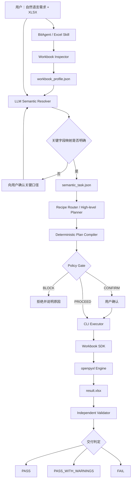

# Excel Agent MVP 总体架构设计 V3

## 1. 文档定位

本文是 SheetPilot MVP 的总体架构实施基线。它回答以下问题：

- 用户的自然语言需求如何与真实 Excel 字段对应。
- LLM、Plan Compiler、CLI Executor、Workbook SDK 和 Excel 引擎如何分工。
- 哪些问题必须拦截，哪些问题允许带警告继续。
- MVP 使用 openpyxl、Excel COM 还是 Univer。
- 一次业务任务如何从理解到交付形成可用闭环。

详细数据结构和接口见 [05-mvp-detailed-design-v3.md](./05-mvp-detailed-design-v3.md)。

## 2. MVP 目标

MVP 要证明的不是“能处理任意 Excel”，而是以下闭环能够稳定成立：

1. 读取用户提供的真实 XLSX，而不是用合成模板替代。
2. LLM 基于工作表、表头、样本值和数据类型理解业务字段。
3. LLM 选择固定业务配方，或组合少量编排级原子能力。
4. 确定性代码把高层意图编译为安全、可执行的计划。
5. 自研轻量 CLI Executor 在工作副本上一次性完成任务。
6. 独立 Validator 拦截文件损坏、计划外修改和明显业务错误。
7. 非关键瑕疵不阻断交付，以警告形式呈现。

## 3. 核心设计原则

### 3.1 先理解工作簿，再规划任务

LLM 不能只用用户问题和字段名进行匹配。Inspector 必须先提供工作表结构、多行表头、样本值、数据类型、数字格式、公式关系和对象清单，LLM 再完成业务语义映射。

### 3.2 LLM 负责语义，确定性代码负责边界

```text
LLM：用户说的业务概念，对应工作簿中的什么
Plan Compiler：这些映射如何变成合法操作
Policy Gate：是否存在不可接受的风险
Executor：如何稳定完成全部操作
Validator：结果是否可用、是否出现严重错误
```

Plan Compiler 不尝试用字符串规则替代业务理解，也不因为字段名称不完全一致就直接失败。

### 3.3 高层编排，底层批量执行

LLM 组合的是 `read_table`、`aggregate`、`write_table`、`add_formula_column`、`create_chart` 等编排级能力。大量单元格读写、公式填充、格式设置和图表参数由 Workbook SDK 和底层引擎完成。

### 3.4 审核服务于可用性

审核不是把所有不确定性都变成失败。只有文件损坏、原文件覆盖、关键业务口径不明、明显越权和无法可信交付等问题才阻断。

结果分为：

- `PASS`：核心需求和必需检查通过。
- `PASS_WITH_WARNINGS`：结果可用，但存在非关键限制。
- `FAIL`：执行失败、文件不可信或核心需求错误。
- `UNSUPPORTED`：请求或输入超出当前能力。

### 3.5 CLI 是边界，库是内核

CLI Executor 由 SheetPilot 自己实现，但只承担任务生命周期和编排。Excel 操作不从 OOXML 手写实现，而是通过 Workbook SDK 调用 openpyxl；未来再按实际需要接入 Excel COM 或 Univer。

### 3.6 原文件不可变，结果可复盘

输入文件只读并计算哈希。每次运行在独立任务目录中创建工作副本，保存任务、语义映射、计划、事件、变更和验收证据。

## 4. 总体架构



## 5. 端到端流程

### 5.1 接收任务

Excel Skill 收集：

- 输入文件路径。
- 用户的自然语言目标。
- 用户明确给出的指标、维度、时间范围和输出要求。
- 是否允许新建工作表、修改已有区域或使用公式。

### 5.2 只读检查工作簿

Inspector 输出：

- 工作表名称、可见性、使用区域和表格对象。
- 多行候选表头及其位置。
- 每个候选字段的样本值、推断类型、空值率和数字格式。
- 公式、合并单元格、图表和高级对象概况。
- OOXML 风险部件和输入 SHA-256。

Inspector 不负责解释“销售收入”是什么，只负责提供足够的事实。

### 5.3 LLM 语义解析

LLM 同时读取用户需求和工作簿画像，完成：

- 业务概念到工作表和字段的映射。
- 可能的派生字段推导，例如“收入 = 数量 × 单价”。
- 时间字段、粒度、单位和统计口径识别。
- 字段候选、置信度、依据和替代项记录。
- 关键歧义识别。

高置信度映射可以自动继续；关键指标存在多个合理候选时向用户确认；非关键展示字段允许选择最合理候选并记录警告。

### 5.4 业务路由和高层计划

执行路径按以下顺序选择：

```text
完整命中固定业务配方
  -> 使用配方

配方覆盖主体，存在少量差异
  -> 配方 + 编排级原子能力

未命中配方，但受支持能力能够表达
  -> LLM 组合编排级原子能力

能力缺失或文件不受支持
  -> UNSUPPORTED
```

MVP 不允许 LLM 生成任意 Python 或 JavaScript。

### 5.5 确定性计划编译

Plan Compiler 将高层计划编译为线性执行步骤，并检查：

- 操作名称和参数 Schema。
- 输入输出依赖。
- 工作表和字段映射是否引用真实对象。
- 读写范围、范围冲突和写入规模。
- 引擎是否支持所需能力。
- 每项核心需求是否有对应验收规则。

它不重新判断业务字段含义，只验证语义解析结果在结构上可执行。

### 5.6 分级门禁

Policy Gate 输出三种决策：

| 决策 | 典型情况 | 处理 |
|---|---|---|
| `BLOCK` | 覆盖输入、文件可能损坏、计划外路径、明确不支持的高级对象 | 停止 |
| `CONFIRM` | 修改大量已有公式、关键字段存在两个接近候选、删除或重命名对象 | 用户确认后继续 |
| `PROCEED` | 新建汇总表、低风险格式调整、高置信度字段映射 | 自动执行 |

样式不完美、截图不可用、非关键字段置信度一般等问题不应成为 `BLOCK`。

### 5.7 稳定执行

CLI Executor：

1. 重新校验任务、计划和输入哈希。
2. 创建工作副本。
3. 按计划调用 Workbook SDK。
4. 记录每一步状态和实际变更。
5. 保存到临时输出。
6. 重新打开临时输出确认文件可读。
7. 调用 Validator。
8. 只有结果可交付时才发布最终文件。

### 5.8 独立验收

Validator 重新打开输入和输出，检查：

- 文件和 OOXML 可打开。
- 原输入哈希未变化。
- 核心结果表、指标和图表存在。
- 业务汇总可与源数据抽样或全量复算对账。
- 没有严重公式错误和计划外核心数据修改。
- 非关键布局问题转为 warning。

Validator 不要求所有任务都完成截图、真实 Excel 重算和高级视觉评审。验收项根据任务风险和能力动态启用。

## 6. 组件职责

### 6.1 Excel Skill

- 定义 Agent 的操作流程和交互规则。
- 触发 `inspect` 并把画像提供给 LLM。
- 生成 `semantic_task.json` 和高层计划。
- 对关键歧义向用户提问。
- 调用 CLI 并解释执行结果。

### 6.2 Workbook Inspector

- 纯确定性、只读。
- 输出适合 LLM 使用的紧凑画像，而不是完整工作簿转储。
- 对大表采用表头、统计和有限样本策略。

### 6.3 LLM Semantic Resolver

- 位于 Agent 层，不内置在 CLI 中。
- 负责业务语义、字段映射和歧义判断。
- 输出结构化结果，不直接修改文件。

### 6.4 Recipe Router / High-level Planner

- 优先选择固定业务配方。
- 允许 LLM 组合有限的编排级能力。
- 不向 LLM 暴露大量单元格级 API。

### 6.5 Plan Compiler

- 由确定性 Python 代码实现。
- 校验并展开高层操作。
- 计算精确的读写集合和预计变更。

### 6.6 CLI Executor

- SheetPilot 自研轻量 Python 编排器。
- 负责进程边界、任务目录、状态、错误、超时和日志。
- 不负责自然语言理解，也不自己实现 Excel 文件格式。

### 6.7 Workbook SDK

对 Executor 和配方提供稳定的区域级能力：

```text
read_table
aggregate_table
create_sheet
write_table
fill_formulas
apply_style_preset
set_column_widths
freeze_panes
create_chart
```

SDK 内部完成大量细粒度单元格操作，并统一记录变更。

### 6.8 Excel Engine

MVP 使用 openpyxl：

- 适合普通 XLSX 的读取、写入、公式、基础格式和图表。
- 不负责公式计算。
- 检测到无法安全保留的对象时停止。

Excel COM 作为可选验证适配器，用于真实重算；不作为 MVP 主执行引擎。Univer 不进入 MVP 主路径，未来需要 Web 工作台或持续编辑状态时作为独立 Engine 接入。

### 6.9 Validator

- 独立于执行器重新加载文件。
- 根据任务生成核心检查和辅助检查。
- 核心检查失败才阻断。
- 输出证据、警告和最终状态。

## 7. MVP 技术选型

| 层 | 选型 |
|---|---|
| Agent 接入 | BitAgent Skill + Shell |
| CLI | Python + Typer 或标准库 argparse |
| 数据模型 | Pydantic 或 JSON Schema + dataclass |
| Executor | 自研轻量编排器 |
| Excel SDK | 自研薄封装，底层调用 openpyxl |
| 数据聚合 | 标准库优先，复杂表格可使用 pandas |
| 主执行引擎 | openpyxl |
| 可选重算 | Windows Excel COM |
| 日志 | JSONL |
| 任务产物 | JSON + XLSX |
| 测试 | unittest |

## 8. MVP 支持范围

### 8.1 支持

- 普通 `.xlsx` 输入和输出。
- 从真实输入中识别单行或有限多行表头。
- 通过 LLM 进行字段语义映射。
- 一套经营汇总配方。
- 通用的筛选、分组、聚合、新建结果表、公式列、基础格式和基础图表。
- 高层计划、分级门禁、工作副本、事件日志和独立验收。

### 8.2 不支持

- 任意动态 Python/JavaScript。
- 宏执行、Power Query、数据模型和复杂透视表修改。
- 自动多引擎路由。
- 自动视觉返修。
- 高并发和远程任务服务。
- 无法定义业务口径的开放式财务模型。

## 9. MVP 成功标准

1. Agent 能基于表头和样本值把用户业务概念映射到非同名字段。
2. 关键歧义会请求确认，高置信度映射不会被机械规则拦截。
3. 一次业务任务由一个高层计划驱动，细粒度操作由 SDK 批量完成。
4. 输入文件在全部成功和失败路径中保持不变。
5. 严重风险会 `BLOCK`，低风险问题允许 `PASS_WITH_WARNINGS`。
6. 经营汇总结果能够与源数据复算对账。
7. 任务可仅凭运行目录重放和审计。
8. 不支持对象不会被静默破坏。

## 10. 后续演进

```text
MVP：LLM 语义映射 + 自研 Executor + openpyxl
  -> M1：Excel COM 重算、截图和更强保真验证
  -> M2：更多业务配方和编排级能力
  -> M3：第二执行引擎及真实契约测试
  -> M4：具备隔离环境后开放受控动态代码
```

Univer 只有在产品需要 Web 工作台、持续编辑状态或 `.unv` 交付时进入主架构，不能为了复用既有迁移成果而提前增加 MVP 复杂度。
