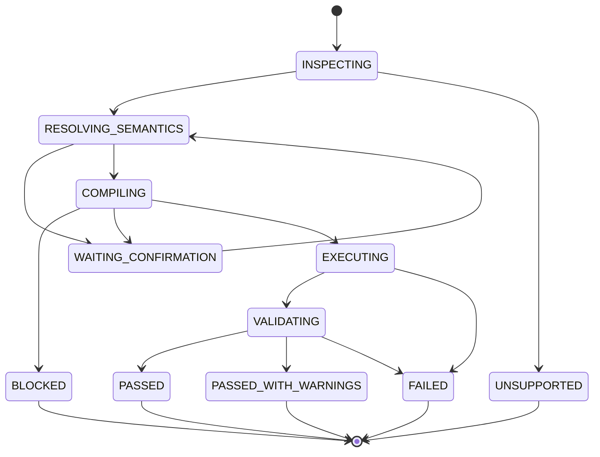
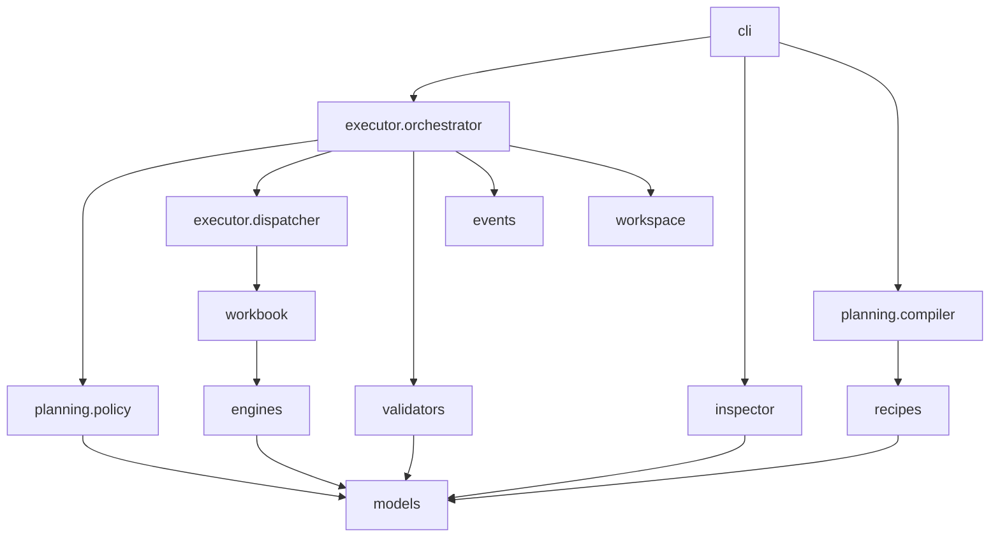

# Excel Agent MVP 详细设计 V3

## 1. 设计范围

本文定义 MVP 的模块、数据契约、CLI、任务状态、执行机制、风险门禁、验证策略和测试要求。总体原则见 [04-mvp-overall-architecture-v3.md](./04-mvp-overall-architecture-v3.md)。

## 2. 模块结构

```text
sheetpilot/
├── pyproject.toml
├── src/sheetpilot/
│   ├── cli.py
│   ├── models.py
│   ├── errors.py
│   ├── events.py
│   ├── workspace.py
│   ├── inspector/
│   │   ├── workbook.py
│   │   ├── headers.py
│   │   ├── samples.py
│   │   └── ooxml_risk.py
│   ├── planning/
│   │   ├── recipe_router.py
│   │   ├── compiler.py
│   │   ├── ranges.py
│   │   └── policy.py
│   ├── executor/
│   │   ├── orchestrator.py
│   │   ├── dispatcher.py
│   │   └── change_recorder.py
│   ├── workbook/
│   │   ├── context.py
│   │   ├── tables.py
│   │   ├── formulas.py
│   │   ├── styles.py
│   │   └── charts.py
│   ├── engines/
│   │   ├── base.py
│   │   └── openpyxl_engine.py
│   ├── recipes/
│   │   └── operating_summary.py
│   └── validators/
│       ├── coordinator.py
│       ├── integrity.py
│       ├── diff.py
│       ├── formulas.py
│       ├── business.py
│       ├── layout.py
│       └── excel_com.py
├── schemas/
│   ├── workbook-profile.schema.json
│   ├── semantic-task.schema.json
│   ├── high-level-plan.schema.json
│   ├── execution-plan.schema.json
│   └── result.schema.json
└── tests/
    ├── unit/
    ├── integration/
    └── fixtures/
```

MVP 使用单进程、单任务串行执行，不引入数据库、队列和远程 Worker。

## 3. 工作簿检查设计

### 3.1 检查原则

Inspector 的输出需要同时服务于 LLM 语义理解和确定性安全检查。它不能只返回工作表名称，也不能把整个工作簿全部发送给 LLM。

### 3.2 `workbook_profile.json`

```json
{
  "schema_version": "1.0",
  "input": {
    "path": "D:/data/orders.xlsx",
    "sha256": "...",
    "size_bytes": 182734,
    "format": "xlsx"
  },
  "sheets": [
    {
      "name": "订单明细",
      "visibility": "visible",
      "used_range": "A1:H20341",
      "header_candidates": [
        {
          "row_start": 1,
          "row_end": 1,
          "confidence": 0.97,
          "fields": [
            {
              "column": "A",
              "header": "下单日期",
              "inferred_type": "date",
              "samples": ["2026-01-03", "2026-01-04"],
              "null_ratio": 0.001,
              "number_format": "yyyy-mm-dd"
            },
            {
              "column": "G",
              "header": "含税金额",
              "inferred_type": "number",
              "samples": [12800.0, 5600.0],
              "null_ratio": 0.0,
              "number_format": "#,##0.00"
            }
          ]
        }
      ],
      "formula_count": 0,
      "chart_count": 0
    }
  ],
  "risk_objects": [],
  "warnings": []
}
```

### 3.3 样本策略

- 默认每个候选字段最多返回 5 个非空、脱敏样本。
- 同时返回类型、空值率、最小值/最大值或长度范围等摘要。
- 标识符、手机号、身份证等疑似敏感字段默认掩码。
- 大表不把完整行发送给 LLM。
- 多行表头保留层级关系，例如“收入 / 本期 / 含税”。

### 3.4 OOXML 风险检查

Inspector 检查 ZIP 部件、`[Content_Types].xml` 和关系文件。以下对象默认标记为不支持或高风险：

- VBA、ActiveX、OLE。
- 外部链接和数据连接。
- Power Query 和数据模型。
- 透视缓存、切片器。
- 未进入兼容清单的扩展部件。

检查结果是保守筛查，不宣称完整识别所有 Excel 特性。

## 4. LLM 语义解析设计

### 4.1 输入

LLM Semantic Resolver 接收：

- 用户原始需求。
- `workbook_profile.json` 的相关片段。
- 当前支持的业务配方和编排级能力说明。
- 业务术语提示，例如“收入可能对应含税金额、未税金额或数量乘单价”。

### 4.2 输出 `semantic_task.json`

```json
{
  "schema_version": "1.0",
  "task_id": "20260803-001",
  "user_intent": "按销售大区统计本年收入和同比",
  "input_file": "D:/data/orders.xlsx",
  "output_file": "D:/data/orders_result.xlsx",
  "source": {
    "sheet": "订单明细",
    "header_rows": [1]
  },
  "concepts": {
    "date": {
      "field": "下单日期",
      "column": "A",
      "confidence": 0.96,
      "evidence": ["字段类型为日期", "样本覆盖目标年份"],
      "alternatives": []
    },
    "region": {
      "field": "销售大区",
      "column": "C",
      "confidence": 0.93,
      "evidence": ["样本值为华北、华东等区域名称"],
      "alternatives": []
    },
    "revenue": {
      "field": "含税金额",
      "column": "G",
      "confidence": 0.78,
      "evidence": ["逐订单数值字段", "与用户销售收入概念相符"],
      "alternatives": [
        {"field": "未税金额", "column": "F", "confidence": 0.67}
      ]
    }
  },
  "business_definition": {
    "revenue": "SUM(订单明细.含税金额)",
    "current_period": ["2026-01-01", "2026-08-03"],
    "comparison_period": ["2025-01-01", "2025-08-03"]
  },
  "requested_output": {
    "target_sheet": "经营汇总",
    "dimensions": ["region"],
    "metrics": ["revenue", "year_over_year"],
    "chart": "bar"
  },
  "ambiguities": [
    {
      "id": "revenue_tax_basis",
      "severity": "key",
      "question": "销售收入应按含税金额还是未税金额统计？"
    }
  ]
}
```

### 4.3 映射决策规则

置信度只作为辅助信号，不设置一个适用于所有字段的机械阈值。决策同时考虑业务影响：

| 情况 | 决策 |
|---|---|
| 关键指标有两个合理候选，结果差异显著 | `CONFIRM` |
| 高置信度且候选差距明显 | 自动采用并记录依据 |
| 非关键展示字段存在轻微歧义 | 自动采用，增加 warning |
| 字段不存在但可由明确公式推导 | 记录推导表达式后继续 |
| 无字段、无可靠推导 | 请求补充或 `UNSUPPORTED` |

用户确认后必须把选择写回 `semantic_task.json`，不能只保存在聊天上下文。

## 5. 能力与配方设计

### 5.1 LLM 可组合的编排级能力

```text
read_table
select_columns
filter_rows
derive_column
aggregate
sort_rows
create_sheet
write_table
add_formula_column
apply_style_preset
create_chart
freeze_header
```

每项能力声明输入、输出、参数 Schema、风险级别和验收建议。

### 5.2 不暴露给 LLM 的底层能力

```text
set_cell_value
set_font
set_fill
set_border
set_number_format
merge_cells
set_chart_series
```

这些能力仅由 Workbook SDK 内部使用，避免高层计划出现成百上千个步骤。

### 5.3 固定配方

```python
class Recipe(Protocol):
    recipe_id: str

    def match(self, task: SemanticTask) -> MatchResult: ...
    def compile(self, task: SemanticTask) -> HighLevelPlan: ...
    def assertions(self, task: SemanticTask) -> list[Assertion]: ...
```

MVP 提供 `operating_summary`，支持日期、一个或两个分类维度、一个数值指标、同期比较和基础图表。

## 6. 高层计划

### 6.1 `high_level_plan.json`

```json
{
  "schema_version": "1.0",
  "task_id": "20260803-001",
  "strategy": "recipe_plus_operations",
  "recipe": "operating_summary",
  "steps": [
    {
      "id": "read_source",
      "op": "read_table",
      "sheet": "订单明细",
      "fields": ["下单日期", "销售大区", "含税金额"]
    },
    {
      "id": "aggregate_region",
      "op": "aggregate",
      "input": "read_source",
      "group_by": ["销售大区"],
      "metrics": [{"field": "含税金额", "function": "sum", "as": "销售收入"}]
    },
    {
      "id": "write_summary",
      "op": "write_table",
      "input": "aggregate_region",
      "sheet": "经营汇总",
      "anchor": "A3"
    },
    {
      "id": "chart",
      "op": "create_chart",
      "sheet": "经营汇总",
      "source": "write_summary",
      "chart_type": "bar",
      "anchor": "F3"
    }
  ]
}
```

高层计划可以由固定配方生成，也可以由 LLM 组合，但必须经过 Schema 校验和 Plan Compiler。

## 7. Plan Compiler

### 7.1 职责

- 解析和校验高层操作。
- 将语义字段解析为确定的工作表、列和范围。
- 解析步骤输入输出引用。
- 将区域级操作展开为执行步骤，但不展开到单个单元格。
- 计算预计读写集合、规模、风险和验收清单。
- 生成不可变的 `execution_plan.json`。

### 7.2 不负责

- 不使用字段名相似度替代 LLM 语义判断。
- 不修改用户已经确认的业务口径。
- 不直接打开工作簿执行写操作。
- 不因为辅助验证不可用而拒绝所有任务。

### 7.3 `execution_plan.json`

```json
{
  "schema_version": "1.0",
  "plan_id": "plan-20260803-001-v1",
  "task_id": "20260803-001",
  "input_sha256": "...",
  "engine": "openpyxl",
  "steps": [
    {
      "id": "write_summary",
      "handler": "write_table",
      "depends_on": ["aggregate_region"],
      "parameters": {
        "sheet": "经营汇总",
        "anchor": "A3",
        "data_ref": "aggregate_region"
      },
      "expected_writes": ["经营汇总!A3:B10"]
    }
  ],
  "change_budget": {
    "new_sheets": 1,
    "written_cells": 250,
    "new_charts": 1,
    "modified_existing_formulas": 0
  },
  "required_validations": [
    "file_integrity",
    "input_unchanged",
    "business_reconciliation",
    "declared_change_match"
  ]
}
```

### 7.4 编译检查

- 步骤 ID 唯一、依赖无环且引用存在。
- 必需参数完整，未知参数拒绝。
- 工作表、源列和读取范围存在。
- 新工作表名称合法且不冲突。
- 预计写入范围不互相冲突。
- 计划没有修改受保护的输入区域。
- 所需 handler 已注册且引擎支持。
- 每个核心指标至少有一项业务验收。

## 8. Policy Gate

### 8.1 决策模型

```json
{
  "decision": "CONFIRM",
  "reasons": [
    {
      "code": "KEY_SEMANTIC_AMBIGUITY",
      "message": "销售收入存在含税和未税两个候选口径",
      "blocking": false
    }
  ],
  "warnings": []
}
```

### 8.2 `BLOCK`

- 输入和输出解析为同一文件。
- 输入哈希与计划不一致。
- 路径越出允许目录。
- 文件加密、损坏或包含明确不支持且可能被破坏的对象。
- 计划调用未注册能力或写入计划外范围。
- 输出会覆盖输入或其他非任务文件。

### 8.3 `CONFIRM`

- 关键指标口径存在多个合理候选。
- 删除、重命名已有工作表。
- 修改大量已有公式或已有非空业务区域。
- 操作规模明显超过普通任务阈值。
- 当前引擎可能带来已知但可接受的兼容变化。

MVP 原则上不实现删除和大规模原区域修改；对应请求通常为 `UNSUPPORTED`，而不是确认后强行执行。

### 8.4 `PROCEED`

- 在新工作表创建汇总结果。
- 高置信度字段映射且不存在接近候选。
- 低风险样式和布局操作。
- 所有核心业务规则均可验证。

## 9. CLI 设计

### 9.1 命令

```powershell
sheetpilot inspect --input source.xlsx --run-dir runs\run-001
sheetpilot compile --task semantic_task.json --high-level-plan high_level_plan.json --run-dir runs\run-001
sheetpilot execute --plan execution_plan.json --run-dir runs\run-001
sheetpilot validate --run-dir runs\run-001
sheetpilot run --task semantic_task.json --high-level-plan high_level_plan.json --run-dir runs\run-001
```

`run` 是 compile、execute、validate 的便捷组合，但不负责 LLM 语义解析。语义解析由 Agent 在调用 `compile` 前完成。

### 9.2 标准输出和退出码

- 标准输出：一份机器可读 JSON 结果。
- 标准错误：面向调试的简短信息。
- `events.jsonl`：完整阶段事件。

| 退出码 | 含义 |
|---|---|
| 0 | `PASS` 或 `PASS_WITH_WARNINGS` |
| 2 | 输入或 Schema 无效 |
| 3 | `UNSUPPORTED` |
| 4 | Policy `BLOCK` 或需要确认 |
| 5 | 执行失败 |
| 6 | 验收失败 |

需要确认时 CLI 不进行交互式读取，而是输出结构化确认请求，由 Agent 与用户交互后生成新计划版本。

## 10. CLI Executor

### 10.1 核心流程

```python
def execute(plan_path: Path, run_dir: Path) -> ExecutionResult:
    plan = load_execution_plan(plan_path)
    verify_plan_schema(plan)
    verify_input_hash(plan)
    enforce_policy(plan)

    working_path = create_working_copy(plan.input_file, run_dir)
    recorder = ChangeRecorder(run_dir / "execution.json")
    engine = OpenPyxlEngine.open(working_path)
    context = WorkbookContext(engine, recorder, plan.change_budget)

    for step in plan.steps:
        emit_step_started(step)
        dispatch(context, step)
        emit_step_completed(step)

    temporary_output = save_temporary(engine, run_dir)
    verify_reopen(temporary_output)
    return ExecutionResult(temporary_output, recorder.snapshot())
```

### 10.2 事务边界

- 原文件绝不作为 engine 保存目标。
- 任何步骤失败都不发布最终文件。
- openpyxl 内存状态在整个主执行阶段复用，避免反复保存和加载。
- 全部步骤完成后只保存一次临时输出。
- Validator 完成后再将临时输出发布为最终文件。

MVP 不承诺对内存中的每一步回滚；任务级原子性通过“失败不发布工作副本”实现。

### 10.3 Dispatcher

Dispatcher 只允许调用注册 handler：

```python
HANDLERS = {
    "read_table": handle_read_table,
    "aggregate": handle_aggregate,
    "create_sheet": handle_create_sheet,
    "write_table": handle_write_table,
    "add_formula_column": handle_add_formula_column,
    "apply_style_preset": handle_apply_style_preset,
    "create_chart": handle_create_chart,
}
```

计划中不能包含模块路径、函数名、Python 表达式或 Shell 命令。

## 11. Workbook SDK

### 11.1 最小接口

```python
class WorkbookContext:
    def read_table(self, spec: TableReadSpec) -> TableData: ...
    def create_sheet(self, name: str) -> SheetRef: ...
    def write_table(self, spec: TableWriteSpec, data: TableData) -> RangeRef: ...
    def fill_formulas(self, spec: FormulaFillSpec) -> RangeRef: ...
    def apply_style(self, range_ref: RangeRef, preset: str) -> None: ...
    def set_column_widths(self, sheet: str, widths: dict[str, float]) -> None: ...
    def freeze_panes(self, sheet: str, cell: str) -> None: ...
    def create_chart(self, spec: ChartSpec) -> ChartRef: ...
```

### 11.2 SDK 约束

- 所有写操作先检查是否落在计划允许范围。
- 操作自动记录实际触达范围和对象。
- 区域级方法内部负责单元格循环。
- 样式使用有限 preset，避免 LLM 直接生成任意复杂样式对象。
- 公式使用模板和受控变量，不执行 Python `eval`。
- 每个操作具备独立单元测试。

### 11.3 引擎接口

MVP 不提前抽象所有引擎共同语义，只保留最小边界：

```python
class WorkbookEngine(Protocol):
    def sheet_names(self) -> list[str]: ...
    def read_cell(self, sheet: str, row: int, column: int) -> CellValue: ...
    def write_cell(self, sheet: str, row: int, column: int, value: CellValue) -> None: ...
    def create_sheet(self, name: str) -> None: ...
    def save(self, path: Path) -> None: ...
```

Workbook SDK 吸收区域级能力，openpyxl Engine 只封装依赖细节。未来接入 COM 或 Univer 时，应先通过真实配方契约测试，再决定是否扩展接口。

## 12. 数据处理策略

- 普通任务使用 Python 标准库完成筛选、分组和聚合。
- 大数据或复杂透视需求可以在内部使用 pandas，但 pandas 结果不能绕过 Workbook SDK 直接覆盖原工作簿。
- 业务结果表优先写公式还是静态值由任务定义决定。
- 用户需要可追溯和可更新结果时使用公式；一次性聚合结果允许写静态值，但必须保存计算口径和对账证据。

## 13. Validator

### 13.1 检查分级

每个检查声明严重度：

| 严重度 | 含义 | 失败结果 |
|---|---|---|
| `critical` | 文件安全、核心数据和用户明确需求 | `FAIL` |
| `important` | 影响主要可用性但不破坏核心数据 | 通常 `PASS_WITH_WARNINGS`，任务可提升为 `critical` |
| `advisory` | 视觉和体验建议 | warning |

### 13.2 Critical 检查

- 输出文件可打开且 OOXML 关系完整。
- 输入文件哈希未变化。
- 核心结果工作表和数据区域存在。
- 核心业务指标与源数据复算结果在容差内一致。
- 不存在计划外的原有业务数据和公式修改。
- 不存在 `#REF!` 等由本次任务引入的明显公式错误。

### 13.3 Important 和 Advisory 检查

- 列宽、冻结窗格、标题、数字格式和图表标题。
- 图表锚点和数据区域是否明显重叠。
- 可选截图或 Excel COM 渲染。
- 非关键字段映射置信度提示。

截图、COM 或其他辅助验证器不可用时，只在任务明确要求它们为核心证据时阻断。

### 13.4 三方变更核对

```text
execution_plan.expected_writes
        vs
execution.actual_touches
        vs
validator.independent_diff
```

严重计划外业务数据变化为 `FAIL`。仅由 Excel 序列化产生且经过白名单验证的元数据差异可以作为 warning 或忽略项，避免字节级 Diff 造成大量误报。

### 13.5 结果模型

```json
{
  "status": "PASS_WITH_WARNINGS",
  "output_file": "D:/data/orders_result.xlsx",
  "summary": "经营汇总已生成，核心指标对账通过",
  "checks": {
    "critical": {"passed": 6, "failed": 0},
    "important": {"passed": 3, "failed": 1},
    "advisory": {"passed": 1, "failed": 0}
  },
  "warnings": [
    {
      "code": "VISUAL_RENDER_UNAVAILABLE",
      "message": "未执行真实 Excel 截图检查"
    }
  ]
}
```

## 14. 任务状态机



## 15. 任务目录

```text
runs/<run_id>/
├── request.json
├── workbook_profile.json
├── semantic_task.json
├── high_level_plan.json
├── execution_plan.json
├── policy_decision.json
├── input.sha256
├── working.xlsx
├── temporary_output.xlsx
├── result.xlsx
├── execution.json
├── evidence.json
├── result.json
└── events.jsonl
```

用户确认必须写入 `semantic_task.json` 或 `policy_decision.json` 的新版本，包含确认时间、计划版本和确认内容。

## 16. 错误模型

```text
INPUT_INVALID
WORKBOOK_UNSUPPORTED
SEMANTIC_AMBIGUITY
PLAN_INVALID
CONFIRMATION_REQUIRED
POLICY_BLOCKED
CAPABILITY_UNSUPPORTED
EXECUTION_FAILED
OUTPUT_CORRUPTED
VALIDATION_FAILED
```

语义歧义、能力不支持和执行错误必须区分，避免统一返回“Excel 处理失败”。

## 17. 测试设计

### 17.1 单元测试

- 表头候选、多行表头和样本摘要。
- 敏感样本脱敏。
- Semantic Task Schema。
- 高层计划依赖和参数校验。
- 范围解析、冲突和变更预算。
- Policy 三档决策。
- Workbook SDK 区域读写、公式、格式和图表。
- Validator 严重度到最终状态的映射。

### 17.2 语义评测

至少覆盖：

| 用户概念 | 实际字段 | 预期 |
|---|---|---|
| 销售收入 | 含税金额 | 根据样本识别，关键口径需要确认 |
| 地区 | 销售大区 | 自动映射 |
| 日期 | 下单时间 | 自动映射并识别日期类型 |
| 收入 | 数量、单价 | 推导为数量乘单价并记录公式 |
| 利润 | 无成本字段 | 请求补充，不得猜测 |

语义评测检查映射、依据、候选和确认行为，不只检查最终字段字符串。

### 17.3 集成测试

| 场景 | 预期 |
|---|---|
| 非同名字段但样本语义明确 | 自动继续 |
| 关键指标有含税/未税两个候选 | `CONFIRM` |
| 输出仅存在轻微列宽问题 | `PASS_WITH_WARNINGS` |
| 输入输出同路径 | `BLOCK` |
| 输入在编译后被替换 | `BLOCK` |
| 执行器修改计划外原始数据 | `FAIL` |
| 核心汇总与源数据不一致 | `FAIL` |
| 截图能力不可用且用户未强制要求 | 不阻断 |
| 含不支持的高级对象 | 写入前 `UNSUPPORTED` |

### 17.4 端到端验收

使用至少三份结构不同但业务含义相同的经营明细表：字段名、列顺序、工作表名和日期格式均不同。用户使用同一业务问题时，系统应完成合理语义映射、必要确认、汇总生成和业务对账。

这比只在一个固定模板上成功更能证明 MVP 的可用性。

## 18. 实施切片

### Slice 1：Inspector

实现画像、表头、样本、类型、哈希和 OOXML 风险检查。

### Slice 2：语义协议与 Skill

实现 `semantic_task.json` Schema、LLM 提示、候选映射和确认回写。

### Slice 3：能力、配方和 Plan Compiler

实现经营汇总配方、高层能力 Schema、线性计划编译、范围和预算检查。

### Slice 4：Executor、SDK 和 openpyxl

实现工作副本、Dispatcher、区域级 SDK、单次保存和变更记录。

### Slice 5：分级 Validator

实现文件完整性、业务对账、独立差异、公式扫描、warning 和结果模型。

### Slice 6：端到端评测

接入 BitAgent Skill，并用三份异构经营明细完成语义和执行闭环。

## 19. MVP 完成定义

- Inspector 给 LLM 的上下文足以处理非同名字段映射。
- 关键语义歧义会确认，普通差异不会被机械拦截。
- LLM 只组合编排级能力，不执行大量细粒度调用。
- CLI Executor 可重放同一执行计划。
- Workbook SDK 完成细粒度 Excel 操作并记录变更。
- openpyxl 是唯一主执行引擎，Univer 不进入 MVP 主路径。
- Critical 问题阻断，非关键问题可 `PASS_WITH_WARNINGS`。
- 三份异构输入通过端到端评测。
- 完整 unittest 通过，CLI 和 Schema 契约有测试保护。

## 20. 模块开发规格

本章是开发任务拆分和代码评审的直接依据。每个模块均按“输入 -> 处理 -> 输出”工作；模块不得通过全局变量、聊天上下文或未声明文件传递隐式状态。

### 20.1 模块依赖总则



依赖约束：

- `models`、`errors` 不依赖其他业务模块。
- `events` 只依赖模型和标准库，不依赖 CLI、引擎或 Validator。
- `inspector` 只读输入文件，不依赖 Executor。
- `planning` 不调用 Workbook SDK 执行写操作。
- `recipes` 只生成高层计划和业务断言，不直接操作 openpyxl。
- `executor` 可以调用 Policy、Workbook SDK 和 Validator，但不理解自然语言。
- `workbook` 只依赖抽象 Engine，不依赖 CLI 和 LLM。
- `engines` 不依赖配方、Plan Compiler 和 Validator。
- `validators` 重新加载文件，不读取执行器内存中的 workbook 对象。
- 只有 `cli` 和 `orchestrator` 可以组织跨模块流程。

违反以上方向的代码应在评审时拒绝，避免形成循环依赖。

### 20.2 `models.py`：领域模型

#### 功能

集中定义模块间传输的数据类型，作为 Python 内部契约。主要模型包括：

- `WorkbookProfile`
- `SemanticTask`
- `FieldMapping`
- `HighLevelPlan`
- `ExecutionPlan`
- `ExecutionStep`
- `PolicyDecision`
- `ChangeBudget`
- `ExecutionRecord`
- `ValidationReport`
- `TaskResult`

#### 输入与输出

输入是 JSON、字典或显式构造参数；输出是完成类型校验的不可变或受控可变模型。

#### 必须负责

- 必填字段、枚举、基本格式和局部一致性校验。
- Schema 版本字段。
- 路径、范围、任务 ID 等值对象的统一表达。
- 明确的序列化和反序列化。

#### 不负责

- 不访问文件系统。
- 不判断字段业务含义。
- 不执行跨对象业务规则，例如检查工作表是否真实存在。
- 不自动修正未知字段和拼写错误。

#### 错误

模型无效时产生 `INPUT_INVALID` 或 `PLAN_INVALID`，错误必须包含字段路径和原因。

#### 最低测试

- 每个模型的合法构造和 JSON 往返。
- 必填字段缺失、未知字段、错误枚举和错误类型被拒绝。
- Schema 版本不支持时被拒绝。

### 20.3 `errors.py`：统一错误模型

#### 功能

定义 SheetPilot 异常层次和稳定错误码，将底层库异常转换为用户可理解、Agent 可处理的结构化错误。

```python
class SheetPilotError(Exception):
    code: str
    message: str
    details: dict[str, object]
    retryable: bool
```

#### 必须负责

- 定义错误码、默认消息、可重试性和退出码映射。
- 保留底层异常作为内部 cause，但普通结果中不得泄漏堆栈和敏感路径。
- 区分输入、语义、计划、策略、执行和验收错误。

#### 不负责

- 不记录事件。
- 不决定任务最终状态。
- 不在异常类中执行恢复或重试。

#### 最低测试

- 每类错误映射到稳定退出码。
- 异常序列化不包含敏感值和完整单元格数据。

### 20.4 `events.py`：事件记录

#### 功能

写入追加式 `events.jsonl`，用于进度展示和运行复盘。

#### 事件最小字段

```json
{
  "timestamp": "2026-08-03T15:30:00+08:00",
  "run_id": "run-001",
  "phase": "EXECUTING",
  "event": "STEP_COMPLETED",
  "step_id": "write_summary",
  "level": "info",
  "message": "经营汇总表已写入",
  "data": {"written_cells": 16}
}
```

#### 必须负责

- 事件时间、运行 ID、阶段和级别标准化。
- 追加写入和逐行刷新，任务异常时保留已发生事件。
- 对敏感字段和大对象执行过滤与截断。

#### 不负责

- 不作为业务事实源。
- 不从事件日志恢复 workbook 内存状态。
- 不把完整表格、用户原始数据或动态代码写入日志。

#### 最低测试

- 并行写入不在 MVP 范围；串行写入必须产生合法 JSONL。
- 异常中断后历史事件仍可读取。
- 敏感字段脱敏和大字段截断有效。

### 20.5 `workspace.py`：任务目录与文件生命周期

#### 功能

管理每次运行的目录、工作副本、临时输出、最终输出和原文件哈希。

#### 输入

- `run_id`
- 允许的工作根目录
- 输入路径和输出路径

#### 输出

- 已验证的绝对路径对象。
- 已创建的任务目录。
- 输入哈希、工作副本和临时输出路径。

#### 必须负责

- 路径规范化和允许目录检查。
- 防止输入与输出指向同一文件，包括大小写、相对路径和链接解析后的等价路径。
- 创建工作副本，不修改输入。
- 临时输出通过验证后再发布为最终文件。
- 防止覆盖无关已有文件；输出已存在时按任务策略拒绝。

#### 不负责

- 不读取工作簿业务内容。
- 不决定输出文件是否业务正确。
- 不清理历史任务目录，清理属于后续运维能力。

#### 最低测试

- 相对路径、大小写差异和 `..` 目录穿越。
- 输入输出等价路径拒绝。
- 执行失败时输入不变且最终输出未发布。
- 临时文件发布过程不产生半写最终文件。

### 20.6 `inspector.workbook`：工作簿结构检查

#### 功能

以只读方式建立工作簿基础画像，包括工作表、可见性、使用区域、表格、公式、图表和合并区域。

#### 输入

已通过 Workspace 校验的 `.xlsx` 输入路径。

#### 输出

`WorkbookProfile` 的结构部分和输入 SHA-256。

#### 必须负责

- 使用公式模式打开工作簿，保留公式文本。
- 对异常大或异常稀疏的使用区域设置扫描上限。
- 检测读取失败、加密和损坏情况。
- 保证整个检查过程不保存文件。

#### 不负责

- 不解释字段业务意义。
- 不判断汇总口径。
- 不调用 LLM。
- 不尝试修复损坏文件。

#### 最低测试

- 普通、多表、隐藏表、合并单元格和公式工作簿。
- 损坏、加密和伪装扩展名文件。
- 检查前后输入哈希一致。

### 20.7 `inspector.headers`：表头识别

#### 功能

从每张候选数据表的前部区域识别单行或有限多行表头，输出字段位置和层级名称。

#### 必须负责

- 结合非空比例、数据类型变化、合并单元格和后续数据行识别表头。
- 支持一至三行表头。
- 保留原始表头和规范化表头，规范化仅用于比较，不覆盖原文。
- 输出多个候选及置信度，不在证据不足时假装唯一确定。

#### 不负责

- 不把“销售额”映射成用户说的“收入”。
- 不自动丢弃重复字段；重复字段必须保留列位置。
- 不跨工作表合并表头。

#### 最低测试

- 标题行在表头上方、空行、多行表头、合并表头、重复字段和无表头数据。

### 20.8 `inspector.samples`：类型与样本摘要

#### 功能

为 LLM 语义解析生成紧凑、脱敏的字段证据。

#### 必须负责

- 推断日期、数值、布尔、文本和标识符等基础类型。
- 输出有限样本、空值率、唯一值数量估计和数值/长度范围。
- 保留 Excel 数字格式作为单位和日期证据。
- 对手机号、证件号、邮箱等疑似敏感值脱敏。

#### 不负责

- 不进行业务分类模型推理。
- 不把完整列或大量原始行写入画像。
- 不把数字格式当作绝对业务含义。

#### 最低测试

- 日期序列号、百分比、金额、编码型数字、混合类型和敏感文本。

### 20.9 `inspector.ooxml_risk`：高级对象风险扫描

#### 功能

直接检查 XLSX ZIP 部件、Content Types 和 Relationships，发现 openpyxl 可能无法安全保留的对象。

#### 必须负责

- 维护显式兼容清单和拒绝清单。
- 报告部件路径、关系类型和风险原因。
- 对未知扩展采用保守结论。
- 区分 `unsupported` 和 `warning`。

#### 不负责

- 不执行宏、刷新连接或打开外部文件。
- 不声称能够识别所有 Excel 私有扩展。
- 不修改 OOXML 包。

#### 最低测试

- VBA、外部链接、透视缓存、ActiveX、普通图表和未知扩展部件样本。

### 20.10 Excel Skill / LLM Semantic Resolver：语义理解

#### 部署边界

该模块位于 BitAgent/Skill 层，不属于 CLI Python 进程。CLI 不调用模型 API，也不持有模型密钥。

#### 输入

- 用户原始需求。
- 与任务相关的 `WorkbookProfile` 片段。
- 可用配方和高层能力目录。
- 已有用户确认。

#### 输出

- `semantic_task.json`
- 必要时的结构化确认问题
- 字段候选、置信度、依据和推导公式

#### 必须负责

- 结合字段名、样本值、数据类型、格式和邻接关系完成业务映射。
- 明确维度、指标、时间范围、统计粒度和单位。
- 区分事实字段和派生概念。
- 识别对结果有实质影响的关键歧义。
- 用户确认后生成新的语义任务版本。

#### 不负责

- 不直接修改 XLSX。
- 不生成可执行 Python、JavaScript 或 Shell。
- 不自行绕过不支持对象和路径策略。
- 不把低置信度数字当作唯一决策依据。

#### 失败与降级

- 关键歧义：`CONFIRMATION_REQUIRED`。
- 缺乏可靠映射且不可推导：`SEMANTIC_AMBIGUITY` 或 `CAPABILITY_UNSUPPORTED`。
- 非关键歧义：选取最合理候选并写入 warning。

#### 最低评测

- 同一业务概念在不同字段命名和列顺序下映射正确。
- 含税/未税等关键口径触发确认。
- 无成本字段时不得臆造利润。

### 20.11 `planning.recipe_router`：执行策略选择

#### 功能

根据 `SemanticTask` 判断使用固定配方、配方加扩展操作，还是纯高层能力组合。

#### 输出

```python
RouteDecision(
    strategy="recipe_plus_operations",
    recipe_id="operating_summary",
    uncovered_requirements=["custom_chart_title"],
)
```

#### 必须负责

- 使用配方声明的前置条件和覆盖能力进行匹配。
- 优先选择能够完整覆盖核心需求的稳定配方。
- 显式输出未覆盖需求。

#### 不负责

- 不根据配方名称做模糊猜测。
- 不直接执行配方。
- 不为了命中配方而改变用户业务口径。
- MVP 不实现复杂候选评分和自动多引擎选择。

#### 最低测试

- 完整命中、部分命中、不命中和多个候选冲突。

### 20.12 `recipes.operating_summary`：经营汇总配方

#### 功能

把已确认的日期、分类维度、金额指标和时间口径转换为标准经营汇总高层计划，并提供业务验收断言。

#### 输入

已经完成字段映射的 `SemanticTask`。配方不得自行重新猜字段。

#### 输出

- `HighLevelPlan`
- 配方专属 `Assertion` 列表
- 推荐格式和图表配置

#### 必须负责

- 检查所需业务概念已映射。
- 生成读取、过滤、聚合、写表和图表步骤。
- 明确空值、无同期数据、负值和重复记录的处理规则。
- 定义源数据复算与汇总结果对账规则。

#### 不负责

- 不读取或写入工作簿。
- 不自行调用 pandas/openpyxl。
- 不处理任意财务模型。
- 不硬编码固定字段名和固定示例数据。

#### 最低测试

- 单维和双维汇总、本期/同期、空分类、无同期、负数和日期边界。

### 20.13 `planning.compiler`：确定性计划编译

#### 输入

- `SemanticTask`
- `HighLevelPlan`
- `WorkbookProfile`
- handler 能力清单

#### 输出

不可变的 `ExecutionPlan`。

#### 必须负责

- 校验步骤和依赖。
- 将语义字段解析为精确列地址。
- 将数据引用解析为前序步骤输出。
- 计算预计读取、写入范围和变更预算。
- 确认 handler、引擎能力和验收规则存在。
- 绑定输入 SHA-256。

#### 不负责

- 不重新做 LLM 字段映射。
- 不读取用户聊天记录。
- 不执行任何写入操作。
- 不生成动态代码。

#### 最低测试

- 相同输入生成语义一致的计划。
- 缺失依赖、循环依赖、未知 handler、范围冲突和超预算被识别。
- 输入画像中的重复表头按列地址准确解析。

### 20.14 `planning.ranges`：范围和值对象

#### 功能

提供工作表名、A1 地址、矩形范围、表格区域和对象锚点的解析、规范化、包含与相交判断。

#### 必须负责

- 正确处理带空格、中文和单引号的工作表名。
- 防止无界整列、整行范围导致过量扫描或写入。
- 提供范围面积和冲突判断。

#### 不负责

- 不读取工作簿。
- 不判断范围内数据业务含义。

#### 最低测试

- 中文表名、转义表名、绝对地址、非法地址、边界列和范围相交。

### 20.15 `planning.policy`：分级风险门禁

#### 输入

- `ExecutionPlan`
- `WorkbookProfile`
- `SemanticTask`
- 用户确认记录
- 系统策略配置

#### 输出

`PolicyDecision(BLOCK | CONFIRM | PROCEED)`、原因和 warnings。

#### 必须负责

- 执行路径、输入保护、高级对象、变更规模和确认有效性检查。
- 原因必须使用稳定错误码并指向具体对象。
- 计划版本变化后使旧确认失效。

#### 不负责

- 不评价视觉审美。
- 不因为所有 warning 而升级为 BLOCK。
- 不修改计划以规避风险。
- 不与用户直接交互。

#### 最低测试

- 每条 BLOCK、CONFIRM 和 PROCEED 规则。
- 多条规则并存时最严重决策优先。
- 旧计划确认不能用于新计划。

### 20.16 `executor.orchestrator`：任务生命周期

#### 功能

实现从加载执行计划到产生临时输出和触发验收的唯一主流程。

#### 必须负责

- 按状态机推进任务。
- 执行前重新检查输入哈希和 Policy。
- 创建工作副本、Engine、WorkbookContext 和 ChangeRecorder。
- 按依赖顺序调用 Dispatcher。
- 统一处理异常、事件、关闭资源和结果发布。
- 保证失败时不发布最终输出。

#### 不负责

- 不理解用户自然语言。
- 不实现单元格读写。
- 不在运行时任意改变计划步骤。
- 不把 Executor 自报成功当成最终 PASS。

#### 最低测试

- 正常执行、步骤失败、保存失败、验证失败和资源关闭。
- 输入在编译后变化时拒绝执行。
- 任一步失败均不发布最终文件。

### 20.17 `executor.dispatcher`：步骤分发

#### 功能

将 `ExecutionStep.handler` 映射到注册的确定性处理函数。

#### 必须负责

- handler 白名单。
- 调用前参数模型校验。
- 将前序步骤结果以受控 `DataRef` 提供给后续步骤。
- 返回结构化 `StepResult`。

#### 不负责

- 不动态 import 计划指定模块。
- 不执行表达式、Shell 或 LLM 生成代码。
- 不自行重试非幂等写步骤。

#### 最低测试

- 每个 handler 的注册、未知 handler 拒绝、参数错误和输出引用。

### 20.18 `executor.change_recorder`：执行变更记录

#### 功能

记录 Workbook SDK 实际触达的工作表、范围、公式和对象，用于预算检查和三方 Diff。

#### 必须负责

- 区分读取、创建、写值、写公式、格式和图表变化。
- 范围合并和计数，避免逐单元格日志膨胀。
- 每次写操作后检查是否超出计划允许集合和预算。

#### 不负责

- 不作为独立验收证据。
- 不记录完整单元格值。
- 不忽略 SDK 外部的未知写入；Validator 负责发现这类差异。

#### 最低测试

- 范围合并、预算超限、计划外触达和变更序列化。

### 20.19 `workbook.context`：Workbook SDK 门面

#### 功能

向 Dispatcher 和配方 handler 提供统一的区域级 Excel 操作，并集中执行范围授权和变更记录。

#### 必须负责

- 每次写入前校验允许范围。
- 调用具体 `tables/formulas/styles/charts` 服务。
- 隐藏 openpyxl 对象，避免上层绕过 SDK。
- 统一数据类型、日期和空值转换。

#### 不负责

- 不决定调用哪些业务步骤。
- 不暴露底层 workbook 对象给上层。
- 不执行用户提供的任意表达式。

#### 最低测试

- 所有公开方法的授权、委派、变更记录和异常转换。

### 20.20 `workbook.tables`：表格读取、写入和聚合

#### 功能

- 将指定源区域读取为带字段元数据的 `TableData`。
- 执行确定性的筛选、派生、分组和聚合。
- 将二维结果写入目标区域。

#### 必须负责

- 保留数值、日期、布尔和文本类型。
- 明确定义空值、重复值和错误单元格处理。
- 写入前计算精确输出尺寸。
- 大表操作记录行数和耗时，不记录全部数据。

#### 不负责

- 不猜测字段映射。
- 不自动删除源数据。
- 不直接应用业务样式。

#### 最低测试

- 类型保持、空值、日期边界、分组聚合、稳定排序和输出尺寸。

### 20.21 `workbook.formulas`：受控公式生成

#### 功能

根据已注册公式模板和字段/范围参数生成 Excel 公式并批量填充。

#### 必须负责

- 正确处理相对和绝对引用。
- 工作表名统一转义。
- 对零除、缺失值等常见情况提供受控保护。
- 记录公式模板、目标范围和代表性公式。

#### 不负责

- 不执行 Python `eval`。
- 不接受任意公式作为动态代码入口；MVP 只允许白名单函数和模板。
- 不声称 openpyxl 能计算公式。

#### 最低测试

- 引用填充、跨表引用、绝对引用、特殊表名、零除和公式扫描。

### 20.22 `workbook.styles`：样式预设

#### 功能

将有限的样式 preset 应用到标题、表头、明细、总计、输入和公式区域。

#### 必须负责

- 维护稳定预设及版本。
- 支持字体、填充、边框、对齐和数字格式。
- 尽量匹配现有工作簿风格；新建表无参考时使用默认业务样式。
- 限制异常列宽和行高。

#### 不负责

- 不做自由视觉设计。
- 不覆盖未声明的既有样式。
- 不让 LLM 传入任意 openpyxl Style 对象。

#### 最低测试

- 每个 preset 的关键属性、数字格式和仅限目标范围修改。

### 20.23 `workbook.charts`：基础图表

#### 功能

创建柱状图、折线图和饼图等 MVP 白名单图表。

#### 必须负责

- 校验数据源范围、分类范围和系列数量。
- 设置标题、轴标题、图例和锚点。
- 防止空数据和明显覆盖结果表。
- 记录图表对象和引用范围。

#### 不负责

- 不支持任意高级图表、组合图或动态脚本配置。
- 不保证不同 Excel 渲染器像素级一致。

#### 最低测试

- 每种支持图表可重新打开、系列引用正确、空数据拒绝和锚点检查。

### 20.24 `engines.base`：最小引擎协议

#### 功能

隔离 Workbook SDK 与具体 Excel 库，不提前抽象 Univer、COM 的所有语义。

#### 必须负责

- 定义 MVP 真正使用的单元格、工作表、图表和保存原语。
- 对返回值和异常规定稳定类型。

#### 不负责

- 不包含业务配方。
- 不包含 import/export/finalize 等仅特定引擎需要的假想接口。
- 不进行引擎自动路由。

#### 最低测试

使用契约测试验证 openpyxl Engine。第二引擎只有通过同一契约或明确扩展契约后才能接入。

### 20.25 `engines.openpyxl_engine`：MVP 文件执行引擎

#### 功能

将 Engine 协议映射到 openpyxl，负责 workbook 对象生命周期和最终保存。

#### 必须负责

- 只打开 Workspace 提供的工作副本。
- 以保留公式的模式加载。
- 实现基础值、公式、样式、工作表和图表原语。
- 把 openpyxl 异常转换为统一错误。
- 保存后关闭资源。

#### 不负责

- 不计算公式。
- 不尝试保留 Inspector 已判定不支持的高级对象。
- 不直接决定写入范围是否合法，授权由 WorkbookContext 负责。
- 不打开原输入作为保存目标。

#### 最低测试

- Engine 契约测试。
- 读写往返、公式保留、样式、图表、保存失败和资源关闭。

### 20.26 `validators.coordinator`：验收编排

#### 功能

根据 `ExecutionPlan.required_validations` 选择检查器、执行检查并计算最终状态。

#### 必须负责

- 每项检查具有 `critical/important/advisory` 严重度。
- 必需检查缺失时按任务契约处理。
- 聚合证据、错误和 warnings。
- 只有该模块可以产生最终 `PASS` 或 `PASS_WITH_WARNINGS`。

#### 不负责

- 不修改结果文件。
- 不自动降低计划声明的检查严重度。
- 不信任 Executor 的成功状态。

#### 最低测试

- 各严重度组合到最终状态的映射。
- 检查器异常、不可用和超时处理。

### 20.27 `validators.integrity`：文件完整性

#### 功能

重新打开结果 ZIP、OOXML 和 workbook，检查基本关系、必需部件和工作表结构。

#### 必须负责

- 使用全新读取实例。
- 检查结果可打开、必需工作表存在、输入哈希未变化。
- 对保存造成的工作表丢失、关系损坏给出 critical failure。

#### 不负责

- 不判断业务金额是否正确。
- 不修复 OOXML。

#### 最低测试

- 正常文件、截断 ZIP、缺少 workbook 部件、缺表和输入被改动。

### 20.28 `validators.diff`：独立差异检查

#### 功能

独立比较原输入和输出的业务结构、值、公式、样式摘要和对象清单，与计划及执行记录核对。

#### 必须负责

- 忽略已验证的无意义序列化元数据差异。
- 对原有值和公式的计划外变化保持严格。
- 输出按工作表和范围聚合的差异证据。

#### 不负责

- 不做字节级文件相等判断。
- 不使用 ChangeRecorder 作为唯一事实。
- 不比较每个样式内部 ID，避免 openpyxl 重排造成误报。

#### 最低测试

- 计划内新增、计划外改单元格、公式变化、样式 ID 重排和元数据变化。

### 20.29 `validators.formulas`：公式检查

#### 功能

检查新增或修改公式的文本、引用、填充模式和明显错误；需要时协调真实重算适配器。

#### 必须负责

- 扫描 `#REF!`、`#DIV/0!`、`#VALUE!`、`#NAME?` 等错误。
- 检查公式覆盖范围和相邻模式一致性。
- 区分“公式文本合理”和“公式已经真实计算”。

#### 不负责

- 不把 openpyxl 的 `data_only=None` 当成公式错误。
- 不保证任意 Excel 函数在 LibreOffice 中等价。

#### 最低测试

- 合法公式、错误引用、填充偏移、缓存缺失和重算不可用。

### 20.30 `validators.business`：业务对账

#### 功能

重新从原输入读取必要字段，独立复算配方核心指标，并与输出比较。

#### 必须负责

- 使用配方提供的业务断言和容差。
- 独立于执行过程重新聚合。
- 输出源行数、过滤行数、复算值、输出值和差异。
- 对核心指标不一致产生 critical failure。

#### 不负责

- 不从输出反推源数据。
- 不自行发明未声明的业务规则。
- 不因浮点微小误差直接失败，使用显式绝对或相对容差。

#### 最低测试

- 正确对账、过滤条件错误、漏行、重复行、浮点容差和空数据。

### 20.31 `validators.layout`：确定性布局检查

#### 功能

检查标题、列宽、冻结窗格、数字格式、图表标题和锚点等基础可用性。

#### 必须负责

- 只执行确定性规则。
- 默认将轻微问题标记为 important 或 advisory。
- 对空图表、核心标题缺失等严重可用性问题允许提升严重度。

#### 不负责

- 不声称替代截图和人工视觉评审。
- 不因轻微视觉偏差阻断核心数据交付。
- 不在 Validator 内自动修复布局。

#### 最低测试

- 正常布局、极端列宽、缺标题、空图表和重叠锚点。

### 20.32 `validators.excel_com`：可选真实 Excel 验证

#### 功能

在 Windows 且安装 Excel 时，通过独立 Excel 进程打开临时输出、重算、另存并读取重算证据；未来可扩展截图。

#### 必须负责

- 使用专门的临时验证副本，避免直接修改待交付文件。
- 设置超时，关闭 workbook 和 Excel 进程。
- 禁止宏执行、外部链接更新和交互提示。
- 输出“通过、失败、不可用”三态结果。

#### 不负责

- 不作为 MVP 主执行引擎。
- 不刷新外部连接。
- 不因用户未要求且 COM 不可用而自动使普通静态值任务失败。

#### 最低测试

- COM 可用时的重算、不可用降级、超时、Excel 异常和进程清理。

### 20.33 `cli.py`：对 Agent 的稳定进程接口

#### 功能

解析命令参数，调用单个应用服务，并把结果转换为标准输出和退出码。

#### 必须负责

- 实现 `inspect`、`compile`、`execute`、`validate` 和 `run`。
- 参数校验和帮助文本。
- 标准输出保持单一 JSON 对象。
- 将 SheetPilotError 映射为稳定退出码。

#### 不负责

- 不包含业务实现。
- 不调用 LLM。
- 不通过交互式 stdin 请求用户确认。
- 不直接 import openpyxl 执行操作。

#### 最低测试

- 每条命令的成功、参数错误和领域错误退出码。
- 标准输出可被 JSON 解析，调试信息不污染标准输出。

### 20.34 `schemas/`：外部契约

#### 功能

定义 Skill、CLI、运行产物和未来其他调用方使用的版本化 JSON 契约。

#### 必须负责

- `additionalProperties: false`，未知字段默认拒绝。
- 必填字段、枚举、格式和版本明确。
- Schema 与 Python 模型保持契约测试一致。
- 不兼容变化升级主版本。

#### 不负责

- 不表达需要访问工作簿才能判断的规则。
- 不用过度复杂的 Schema 代替领域校验。

#### 最低测试

- 所有文档示例通过 Schema。
- Python 模型可接受的数据与 Schema 基本一致。
- 非法和旧版本样本有明确错误。

## 21. 跨模块调用契约

### 21.1 Inspector 到 LLM

```text
输入：用户文件
输出：WorkbookProfile
保证：只读、有限样本、字段位置稳定、风险对象明确
不保证：业务字段已经正确映射
```

### 21.2 LLM 到 Compiler

```text
输入：WorkbookProfile + 用户需求
输出：SemanticTask + HighLevelPlan
保证：每个业务概念包含字段/推导、证据和歧义状态
不保证：计划范围和引擎能力已经合法
```

### 21.3 Compiler 到 Executor

```text
输入：SemanticTask + HighLevelPlan + WorkbookProfile
输出：ExecutionPlan
保证：结构合法、输入哈希绑定、handler 已注册、预算已计算
不保证：执行必然成功或业务结果已经正确
```

### 21.4 Executor 到 Validator

```text
输入：ExecutionPlan + 临时输出 + ExecutionRecord
输出：ValidationReport
保证：临时输出来自工作副本，执行记录完整到 SDK 操作级
不保证：执行记录等同于真实文件差异
```

### 21.5 Validator 到 CLI/Agent

```text
输入：原输入 + 临时输出 + 计划 + 执行记录
输出：TaskResult
保证：最终状态、critical 检查、warnings 和证据路径明确
不保证：PASS 表示支持所有 Excel 高级特性或像素级视觉一致
```

## 22. 开发拆分与完成条件

每个模块进入集成前必须满足：

1. 公共输入输出使用领域模型，不传递无约束 `dict`。
2. 模块边界上的异常转换为统一错误码。
3. 单元测试覆盖正常、边界和失败路径。
4. 不通过导入具体实现绕过既定依赖方向。
5. 不把用户数据和完整表格写入普通日志。
6. 文档示例与实际 Schema/接口同步。

推荐并行开发单元：

| 开发单元 | 包含模块 | 前置依赖 | 交付物 |
|---|---|---|---|
| A：领域契约 | models、errors、schemas | 无 | 模型、Schema、错误码 |
| B：工作簿画像 | inspector、workspace | A | `inspect` 可运行闭环 |
| C：语义层 | Skill、Semantic Resolver 协议 | A、B | 语义映射与确认样例 |
| D：计划层 | recipes、recipe_router、compiler、policy | A、B、C | 可编译 ExecutionPlan |
| E：执行内核 | executor、workbook、openpyxl_engine | A、D | 工作副本执行闭环 |
| F：验收层 | validators | A、B、D、E | 分级 ValidationReport |
| G：接入层 | CLI、Skill 端到端 | A 至 F | 三份异构输入验收 |

开发时可以先用固定的 `semantic_task.json` 替代真实 LLM 输出，使计划层和执行层不必等待 Skill 完成；但该固定样本必须遵守同一 Schema，禁止另建临时接口。
