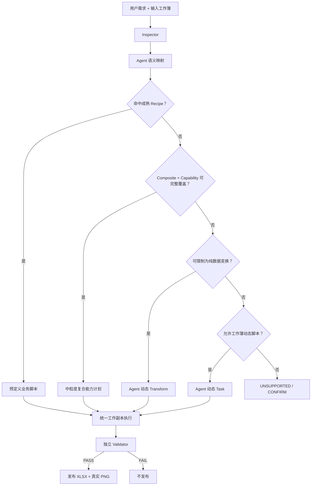

# SheetPilot 测试复盘与混合脚本执行架构 V1

## 1. 文档目的

本文记录两次脏订单报表测试后的事实、问题和架构调整结论，并定义 SheetPilot 下一阶段的混合脚本执行模式。

本文不是替代 `04-mvp-overall-architecture-v3.md`、`05-mvp-detailed-design-v3.md` 和 `06-capability-registry-and-tools-design-v1.md`，而是根据真实 Agent 执行结果，对能力粒度、业务配方、动态脚本和验收边界进行修正。

核心结论：

```text
固定能力提供稳定性
中粒度复合能力提供主要复用效率
少量成熟 Recipe 提供稳定完整流程的直达路径
动态脚本提供开放性
独立 Validator 提供可信度
```

## 2. 测试背景

测试任务是把脏订单输入制作成可审计清洗分析报表，要求：

- 保留原始行追溯关系；
- 生成原始数据、清洗明细、经营总览和异常检查；
- 包含清洗状态、异常原因、标准化字段和公式派生字段；
- 包含 KPI、月份或区域汇总和至少两个原生 Excel 图表；
- 检查原始行数、有效行数、异常行数和金额一致性；
- 输出真实公式；
- 生成真实 PNG 预览；
- 完成后检查实际文件，不信任 Agent 自报。

测试使用 BitAgent 内置 Excel 能力，由 Agent 临时生成 Python 辅助脚本和批量操作命令完成。

## 3. 第一次测试结果

### 3.1 运行特征

第一次测试经历了约 44 个操作阶段，过程中出现：

- resident 文件占用；
- PowerShell 与 `&&` 语法不兼容；
- Unicode 编码错误；
- 大量细粒度 CLI 调用超时；
- 脚本部分执行后留下中间状态；
- 多次切换 Python、Shell、批处理和逐步命令；
- 生成图表、公式和检查表后继续定向修复。

### 3.2 实际文件问题

实际工作簿检查发现：

1. 清洗明细多出一行，把输入表头作为业务数据。
2. 订单 ID 等字段发生列错位。
3. 原始订单数实际为 360，但记录为 361。
4. 异常订单实际为 7，但记录为 8。
5. 多个 Excel 条件公式缺少字符串引号，例如：

```excel
=COUNTIF(CleaningDetail!L:L,Normal)
=SUMIF(CleaningDetail!D:D,Nanjing,CleaningDetail!G:G)
```

6. 运行记录明确报告多个公式错误单元格，但最终仍宣布 PASS。
7. Validation 的预期值本身错误，无法证明结果正确。
8. PNG 只是文字摘要，不包含实际工作表、KPI 或图表渲染。

### 3.3 判定

第一次测试必须判定为 `FAIL`。

最严重的问题不是生成过程曲折，而是“检测到结构和公式错误后仍然自报 PASS”。这证明执行脚本不能拥有最终验收权。

## 4. 第二次测试结果

### 4.1 改进

第二次测试的主体结果明显改善：

- 原始订单数为 360；
- 有效订单数为 353；
- 异常订单数为 7；
- 工作簿包含四个目标工作表；
- 清洗明细通过公式引用原始数据，追溯关系明确；
- 经营总览包含 55 个公式和两个真实 Excel 图表；
- 总销售额为 125,635；
- 总成本为 73,718；
- 清洗字段和异常分类与输入基本一致。

第二次测试证明：Agent 临时生成一个完整任务脚本，可以较快覆盖尚未固化的复杂 Excel 需求。

### 4.2 剩余问题

第二次测试仍不能判定为严格 PASS：

1. 异常检查存在自我证明：

```excel
B5 = COUNTIF(清洗明细!L2:L361,"正常")
C5 = B5
D5 = "通过"
```

预期值和实际值来自同一表达式，状态又被硬编码为通过，不是独立验证。

2. 金额检查只比较“清洗明细”和引用清洗明细的“经营总览”，无法发现清洗过程漏行或错行。
3. PNG 是渐变占位图，不是工作簿真实预览。
4. 没有可靠记录 `started_at`、`finished_at` 和精确 `elapsed_seconds`。
5. Excel 内容主要通过内置能力生成，但 PNG 由临时 Python 脚本伪造，不能宣称完整满足“只用内置 Excel 能力生成预览”。

### 4.3 判定

如果只评价主体 Excel 内容，第二次可判定为 `PASS_WITH_WARNINGS`。

如果“真实 PNG 预览”和“独立检查”属于 Critical 要求，则第二次仍应判定为 `FAIL`。

## 5. 两次测试暴露的系统问题

### 5.1 Agent 临时脚本具有高覆盖率但低稳定性

Agent 可以快速实现未知需求，但每次都需要重新处理：

- 字段索引和表头边界；
- 日期和空值；
- Excel 公式转义；
- 工作表名称引用；
- 批量写入；
- 图表数据范围；
- 文件占用；
- 预览生成；
- 业务核对。

主要业务逻辑通常能够完成，但边缘约束容易失误。

### 5.2 细粒度工具调用成本过高

让 Agent 逐个调用单元格或小范围工具，会带来：

- 调用次数和 token 消耗高；
- 中间状态复杂；
- 失败后难以确定恢复点；
- resident 文件占用；
- JSON、Shell 和编码错误；
- 任务耗时不可预测。

因此，不应只向 Agent 暴露单元格级能力。

### 5.3 预定义能力不能覆盖开放需求

如果所有操作都必须预注册为 handler，则新需求需要同时修改：

- 参数模型；
- 能力注册表；
- Compiler；
- Dispatcher；
- WorkbookContext；
- 底层实现；
- Validator；
- Schema；
- Skill；
- 测试。

这种方式适合稳定能力，不适合作为所有长尾需求的唯一实现路径。

### 5.4 执行成功不等于结果正确

两次测试都说明：

```text
命令返回 0
≠ 公式正确
≠ 业务对账正确
≠ PNG 真实
≠ 最终 PASS
```

执行脚本不能自己决定最终状态。

## 6. 架构目标

下一阶段采用四种规划策略，底层由五类步骤承载：

```text
RECIPE
COMPOSED
DYNAMIC_TRANSFORM
DYNAMIC_TASK
```

其中 `COMPOSED` 计划可以包含 `COMPOSITE` 和 `CAPABILITY`；五类步骤分别为 `RECIPE`、`COMPOSITE`、`CAPABILITY`、`TRANSFORM` 和 `TASK`。策略与步骤类型分开建模，避免把完整任务、业务模块和原子操作混为同一层级。

当风险无法控制或结果无法验收时返回：

```text
UNSUPPORTED
```

选择优先级：

```text
RECIPE
> COMPOSED
> DYNAMIC_TRANSFORM
> DYNAMIC_TASK
> UNSUPPORTED
```

优先级表示默认选择顺序，不表示动态脚本是次要能力。动态脚本是覆盖未知需求的核心机制。

## 7. 总体架构



## 8. 第一层：通用 Excel 能力

### 8.1 定位

通用能力提供跨业务复用的区域级操作：

```text
inspect_workbook
read_table
select_columns
filter_rows
normalize_date
derive_column
aggregate
sort_rows
create_sheet
write_table
add_formula_column
apply_style_preset
create_chart
freeze_header
```

Agent 只提供工作表、字段、条件、范围和样式等参数。

### 8.2 能力粒度

允许暴露：

- 表格读取和写入；
- 结构化过滤和聚合；
- 受控公式模板；
- 样式预设；
- 基础图表；
- 工作表级布局。

不向 Agent 暴露：

```text
set_cell_value
set_font
set_fill
set_border
set_chart_series
```

避免产生数百次细粒度调用。

### 8.3 对外接口

能力实现与传输方式解耦：

```text
Capability Registry
├── CLI Adapter
├── MCP Adapter
└── Skill 能力摘要
```

CLI 和 MCP 只是同一能力的不同暴露方式。MCP 不应重新实现业务逻辑。

## 9. 第二层：复合业务能力与业务指标模块

### 9.1 定位

优先固化可跨任务复用的中粒度业务模块，而不是把一份完整测试题固化成 Recipe。例如：

```text
build_traceable_detail
classify_invalid_rows
calculate_profitability
summarize_by_period
summarize_by_dimension
build_kpi_block
build_reconciliation_sheet
render_sheet_preview
```

这类模块通常由多个原子能力构成，但仍保持明确的参数、输出和验收语义。例如 `calculate_profitability` 只需要 Agent 指定营收列、成本列、利润列、毛利率列和零收入策略。

### 9.2 Agent 职责

Agent 只负责：

- 选择输入工作表；
- 映射业务字段；
- 确认关键口径；
- 提供字段角色、公式参数、日期、维度和目标名称；
- 根据用户要求选择并组合复合模块；
- 阅读 Validator 结果。

### 9.3 复合业务模块职责

复合业务模块固定实现：

- 清洗和异常规则；
- 公式模板；
- 汇总逻辑；
- 一项稳定的业务计算或报表区块；
- 公式模板和异常策略；
- 输入输出字段契约；
- 对应的独立复算断言。

脏订单报表本身属于评测场景，不作为产品 Recipe。它用于验证 Agent 能否正确组合追溯、异常分类、利润计算、期间汇总、KPI、对账、图表和渲染模块。

### 9.4 Recipe 的提升门槛

完整任务只有同时满足以下条件时才提升为 Recipe：

1. 相同任务重复出现；
2. 输入字段角色稳定；
3. 输出结构稳定；
4. 业务公式稳定；
5. 验收规则稳定；
6. 用户确实需要标准化一致输出。

未达到门槛时，由 Agent 在单个任务脚本中组合中粒度模块，不把它展开成几十个 CLI 调用。

## 10. 第三层：复合能力组合

当需求可以由复合业务模块和通用能力完整表达时，生成轻量组合计划：

```json
{
  "steps": [
    {"op": "read_table", "parameters": {}},
    {"op": "filter_rows", "parameters": {}},
    {"op": "aggregate", "parameters": {}},
    {"op": "write_table", "parameters": {}},
    {"op": "create_chart", "parameters": {}}
  ]
}
```

组合计划适用于简单、清晰、可参数化的任务。

如果计划开始出现循环、复杂条件、跨行状态和大量中间变量，不应继续扩展 JSON 表达能力，而应转入动态脚本。

## 11. 第四层：动态脚本

### 11.1 必要性

以下情况允许 Agent 创建脚本：

- 简单需求尚未固化为能力；
- 现有能力缺少某个数据转换；
- 复杂业务逻辑无法通过复合计划合理表达；
- 新场景需要快速验证；
- 需求只出现一次，暂时不值得产品化。

没有动态脚本，SheetPilot 只能处理预先知道的需求，无法发挥 Agent 的编程和泛化能力。

### 11.2 `DYNAMIC_TRANSFORM`

优先允许纯数据变换脚本：

```python
def transform(table, params):
    rows = []
    for row in table.rows:
        rows.append(custom_business_logic(row, params))
    return TableData(table.fields, rows)
```

限制：

- 输入和输出只能是受控 `TableData`；
- 不能访问工作簿对象；
- 不能访问文件系统；
- 不能启动子进程或网络；
- 不能安装依赖。

适合自定义清洗、评分、跨行计算和特殊聚合。

### 11.3 `DYNAMIC_TASK`

当任务需要完整工作簿控制时，允许 Agent 生成受控任务脚本：

```python
def run(ctx, params):
    source = ctx.read_table(...)
    result = custom_transform(source, params)
    target = ctx.create_sheet(params["target_sheet"])
    output = ctx.write_table(target, "A3", result)
    ctx.apply_style(output, "business_table")
```

脚本不能直接取得 openpyxl workbook，也不能自行保存最终文件。

### 11.4 安全边界

动态脚本禁止：

```text
subprocess
os.system
eval / exec
网络访问
动态安装依赖
任意文件读写
直接打开或保存输入工作簿
动态 import 未批准模块
自行发布结果
自行宣布 PASS
```

执行环境要求：

- 独立子进程；
- 导入白名单；
- 工作目录和文件访问限制；
- CPU、内存和超时限制；
- 最小环境变量；
- 只读输入和专用工作副本；
- WorkbookContext 能力隔离；
- ChangeRecorder 记录；
- Validator 独立验收。

### 11.5 执行声明

动态任务执行前至少声明：

```json
{
  "input_file": "...",
  "output_file": "...",
  "source_sheets": ["订单明细"],
  "new_sheets": ["经营分析"],
  "expected_writes": ["经营分析!A1:H500"],
  "change_budget": {
    "new_sheets": 1,
    "written_cells": 4000,
    "new_charts": 2
  },
  "required_validations": [
    "file_integrity",
    "input_unchanged",
    "declared_change_match",
    "business_reconciliation",
    "visual_render"
  ]
}
```

实际触达超过声明范围或预算时立即失败。

## 12. Skill 的职责

Skill 不承载具体单元格循环、公式拼接和图表 API 细节。

Skill 负责：

1. 检查输入文件；
2. 理解用户需求；
3. 映射业务字段；
4. 识别并确认关键歧义；
5. 查询 Recipe、Composite 和 Capability；
6. 选择 `RECIPE`、`COMPOSED`、`DYNAMIC_TRANSFORM` 或 `DYNAMIC_TASK`；
7. 生成参数或受控脚本；
8. 调用统一执行器；
9. 阅读独立验收结果；
10. 只交付 Validator 发布的文件。

Skill 不负责：

- 重复实现公式和样式；
- 逐单元格操作；
- 维护运行时能力白名单；
- 通过读取源码猜测能力是否可用；
- 在失败后绕过安全边界；
- 根据脚本自报结果宣布 PASS。

## 13. Validator 设计结论

### 13.1 最终状态所有权

只有 Validator 可以产生：

```text
PASS
PASS_WITH_WARNINGS
FAIL
```

Recipe、复合计划和动态脚本只能返回执行状态和证据，不能返回最终交付状态。

### 13.2 独立验证

Validator 必须重新读取原输入，并独立计算：

```text
原始数据事实
vs
清洗明细结果
vs
经营总览结果
```

禁止以下伪检查：

```excel
预期值 = 实际值
状态 = "通过"
```

检查项至少包括：

- 原始行数；
- 清洗明细行数；
- 有效与异常行数；
- 异常原因分布；
- 核心销售额和成本；
- 分组汇总之和；
- 公式文本错误；
- 原有数据和公式未被计划外修改；
- 图表对象和引用；
- PNG 真实性。

### 13.3 公式验证

区分：

```text
公式文本存在
公式引用合法
公式填充模式正确
公式已有计算缓存
公式经过真实 Excel 重算
```

openpyxl 或 OOXML 解析只能证明前几项，不能声明完成真实 Excel 重算。

### 13.4 PNG 验证

PNG 必须由真实工作簿渲染链路生成，不能使用：

- 文本摘要图；
- 渐变占位图；
- 与工作簿无关的静态图片。

Validator 至少检查：

- 文件是有效 PNG；
- 像素不是空白或单一背景；
- 包含目标工作表标题或可识别表格区域；
- KPI、关键数字和图表不被裁剪；
- PNG 生成时间晚于最终工作簿保存时间；
- 渲染来源和目标 sheet 有明确记录。

## 14. 严格计时

每个任务必须记录：

```json
{
  "started_at": "2026-08-04T14:00:00.000+08:00",
  "finished_at": "2026-08-04T14:04:32.418+08:00",
  "elapsed_seconds": 272.418,
  "phases": {
    "inspect": 1.2,
    "semantic_mapping": 8.4,
    "compile_or_generate": 3.1,
    "execute": 201.7,
    "validate": 31.8,
    "render": 26.2
  }
}
```

不得用“约 300 秒”替代严格计时。

计时使用单调时钟计算耗时，使用带时区的墙上时间记录开始和结束时间。

## 15. 动态脚本产品化反馈循环

动态脚本不是一次性垃圾代码。经过验证的脚本应进入评估池：

```text
Agent 生成动态脚本
→ 执行成功
→ Validator 通过
→ 相似需求重复出现
→ 人工审查
→ 抽取稳定参数
→ 优先固化为 Composite 或通用 Capability
→ 完整流程达到稳定门槛后才提升为 Recipe
```

下沉规则：

- 可跨任务复用的业务计算、业务规则或报表区块：固化为 Composite；
- 跨业务复用的区域级 Excel 操作：下沉为 Capability；
- 仅当完整流程长期重复，且字段角色、输出结构、公式口径和验收规则稳定时：提升为 Recipe；
- 仅出现一次且高度特殊：保留为运行证据，不注册；
- 无法可靠验收：不得产品化。

## 16. 对现有 SheetPilot 的调整建议

### 16.1 保留

- Inspector；
- WorkbookProfile；
- Workspace 和工作副本；
- OOXML 风险检查；
- Capability Registry；
- Composite Registry；
- WorkbookContext；
- ChangeRecorder；
- Policy Gate；
- Validator；
- Publisher；
- Recipe；
- Skill。

### 16.2 简化

达到提升门槛的固定 Recipe 不必强制经过复杂的双层计划：

```text
TaskSpec
→ Recipe.compile/execute
→ Validator
```

Composite 与 Capability 组合保留轻量步骤计划：

```text
TaskSpec
→ ComposedPlan
→ Dispatcher
→ Validator
```

动态脚本使用独立入口：

```text
TaskSpec
→ Script Guard
→ Sandbox Runner
→ WorkbookContext
→ Validator
```

Recipe、组合计划和动态脚本路径共用工作副本、变更记录和发布机制。

### 16.3 避免

- 不为每个业务变化新增 handler；
- 不把复杂业务逻辑强行表达成 JSON 编程语言；
- 不把完整测试题过早固化为 Recipe；
- 不让 Agent 将 Composite 展开为大量原子调用；
- 不让执行脚本复用自身结果完成所谓独立验证；
- 不为了满足文件存在检查而生成无意义 PNG。

## 17. 实施优先级

### 阶段 1：中粒度业务模块与脏订单评测场景

基于两次测试沉淀可复用模块：

- `build_traceable_detail`；
- `classify_invalid_rows`；
- `calculate_profitability`；
- `summarize_by_period/dimension`；
- `build_kpi_block`；
- `build_reconciliation_sheet`；
- `render_sheet_preview`。

将完整脏订单任务保留在 `tests/scenarios/dirty_orders_report`，用于验证这些模块能否被 Agent 正确组合。

### 阶段 2：动态 Transform Runner

实现纯 `TableData -> TableData` 动态脚本：

- AST 和导入限制；
- 独立进程；
- 超时和内存限制；
- 无文件和工作簿访问；
- 结果类型验证。

### 阶段 3：动态 Task Runner

实现通过 WorkbookContext 操作工作副本的任务脚本：

- 输入输出声明；
- 计划范围和预算；
- 写入授权；
- ChangeRecorder；
- 失败不发布。

### 阶段 4：CLI/MCP 双适配

从同一 Capability Registry 生成：

- CLI 命令；
- MCP Tool Schema；
- Skill 能力摘要。

不维护三份独立能力清单。

## 18. 完成定义

混合脚本架构完成必须满足：

1. 常见分析模块可以通过中粒度复合能力完成。
2. 完整任务默认由 Agent 组合业务模块和通用能力。
3. 能力组合无法表达的任务可以生成受控动态脚本。
4. 动态脚本不能直接打开、保存或发布工作簿。
5. 三种执行路径共用 Workspace、ChangeRecorder 和 Validator。
6. 执行逻辑不能自行宣布最终 PASS。
7. Validator 从原输入独立复算核心指标。
8. PNG 是真实工作簿渲染结果。
9. 严格记录阶段耗时和总耗时。
10. 经过验证且重复出现的动态脚本优先沉淀为复合能力；只有完整流程长期稳定时才提升为 Recipe。
11. CLI、MCP 和 Skill 从同一能力注册表生成可用能力信息。
12. 两次测试中发现的表头错位、公式转义、自证检查和占位 PNG 均有回归测试。
