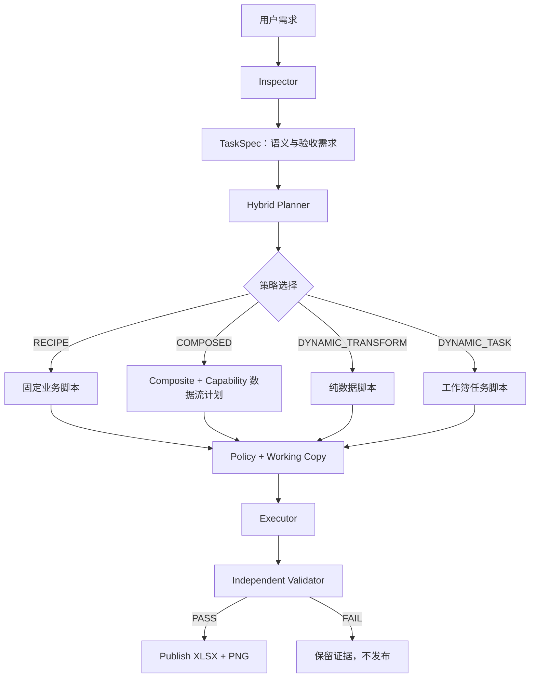
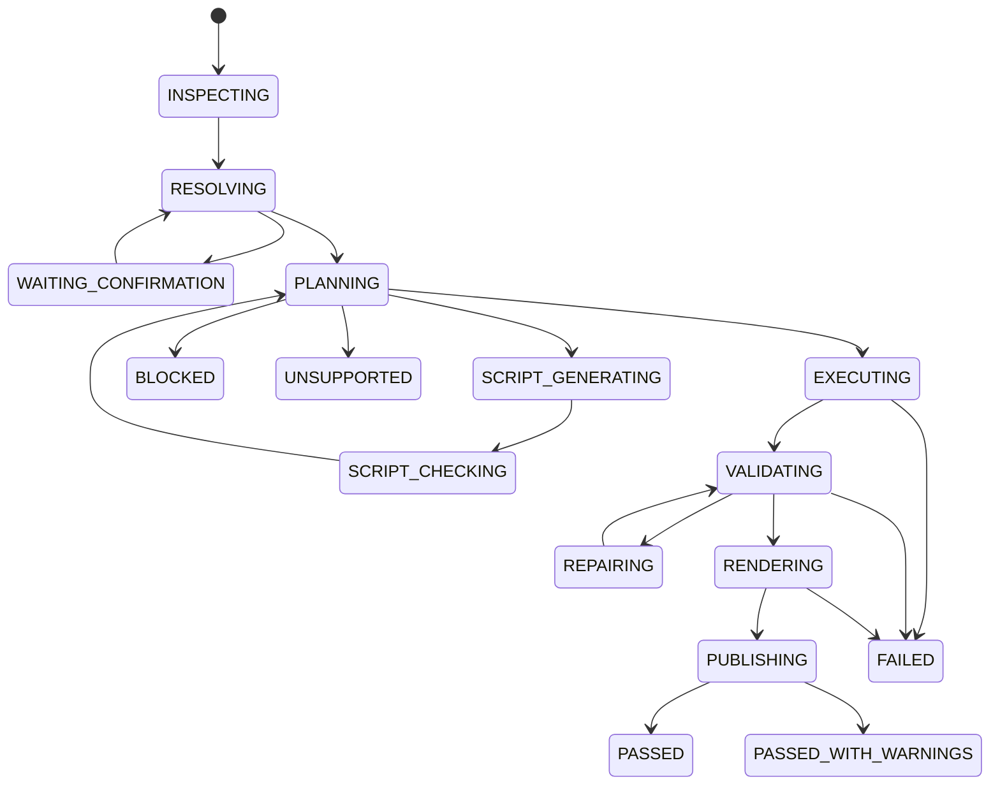

# SheetPilot 混合规划器与脚本运行时 MVP 设计 V1

## 1. 文档目的

本文在 `07-test-retrospective-and-hybrid-script-architecture-v1.md` 的结论上继续细化三个核心问题：

1. 脚本能力如何定义、实现、测试和复用。
2. Agent 如何制定可执行、可验证的组合计划。
3. 当固定能力不能覆盖需求时，Agent 如何自主规划并生成受控脚本。

本文同时给出一个可以直接实施的 MVP 方案。MVP 目标不是构建通用工作流平台，而是在保持 Excel Agent 开放性的同时，解决两次实测中出现的行列错位、公式错误、自证验收、占位 PNG 和多次细粒度调用问题。

## 2. 核心目标

系统应具备以下能力：

- 高频业务计算和报表区块通过复合业务能力完成。
- 常规开放任务可以由区域级通用能力组合完成。
- 简单能力缺口可以由 Agent 生成纯数据变换脚本补齐。
- 复杂长尾任务可以由 Agent 生成受控工作簿任务脚本。
- Agent 可以自主选择路径，但不能自行放宽安全策略或验收标准。
- 执行路径不同，工作副本、变更记录、验证和发布机制相同。
- 动态脚本可以经过真实使用和人工审查后沉淀为复合能力；完整工作流只有达到稳定性门槛后才提升为 Recipe。

## 3. 非目标

MVP 不实现：

- 完全安全的多租户 Python 沙箱；
- 任意第三方依赖安装；
- 任意 VBA、Power Query、数据模型和高级透视对象处理；
- 自动修改系统策略以完成任务；
- 无限制的 Agent 自我重试；
- 通过复杂 JSON DSL 表达任意程序；
- 仅凭 LLM 自报判断结果正确。

## 4. 总体执行模型



系统只保留一份面向执行的 `ExecutionPlan`。Recipe、Composite、Capability 和动态脚本是不同类型的执行步骤，不再强制经过重复的 HighLevelPlan 和 ExecutionPlan 双层转换。

## 5. 脚本能力模型

## 5.1 脚本类型

定义五种脚本类型：

| 类型 | 作用 | 是否访问工作簿 | 是否由 Agent 动态生成 |
|---|---|---:|---:|
| `CAPABILITY` | 单个通用区域级能力 | 通过 Context | 否 |
| `COMPOSITE` | 可复用的非原子业务计算或报表区块 | 通过 Context | 否 |
| `RECIPE` | 长期稳定的完整业务模板 | 通过 Context | 否 |
| `TRANSFORM` | `TableData -> TableData` 数据变换 | 否 | 是 |
| `TASK` | 完整工作簿任务 | 通过 Context | 是 |

五种类型均不能直接保存最终文件。最终保存和发布由 Executor 与 Publisher 负责。

## 5.2 通用能力脚本

通用能力脚本是稳定、可参数化的 Python 实现，例如：

```python
def filter_rows(
    context: CapabilityContext,
    params: FilterRowsParams,
    inputs: CapabilityInputs,
) -> StepResult:
    table = inputs.require_table(params.input)
    result = table_filter.apply(table, params.where)
    return StepResult.table(result)
```

能力必须包含：

```python
CapabilityDefinition(
    name="filter_rows",
    version="1.0",
    parameter_type=FilterRowsParams,
    input_kind="table",
    output_kind="table",
    risk_level="transform",
    handler=filter_rows,
    supported_engines={"openpyxl"},
    required_validations={"business_reconciliation"},
)
```

能力脚本只解决通用技术问题，不包含“有效订单”“销售收入”等业务概念。

## 5.3 复合业务能力与指标模块

复合业务能力封装多个原子操作或一项稳定业务公式，但不代表完整用户任务：

```python
class ProfitabilityComposite:
    name = "calculate_profitability"
    version = "1.0"

    def validate_params(self, params: ProfitabilityParams) -> None: ...
    def estimate(self, params, profile) -> ChangeEstimate: ...
    def execute(self, ctx: WorkbookContext, params) -> CompositeResult: ...
    def assertions(self, params) -> tuple[Assertion, ...]: ...
```

Composite 内部可以调用通用能力的 Python 函数，但不通过 CLI 或 MCP 逐个调用。所有内部步骤在同一进程完成。

优先固化：

- 可追溯明细；
- 异常分类；
- 营收、成本、利润和毛利率；
- 期间和维度汇总；
- KPI 区块；
- 独立对账区块；
- 图表区块和真实预览。

完整任务由 Agent 组合这些模块。只有相同流程长期重复、输入角色、输出结构、公式和验收规则均稳定时，才把组合提升为 Recipe。

## 5.4 动态 Transform

Transform 只接收序列化后的 `TableData` 和参数：

```python
def transform(table, params):
    output = []
    for row in table.rows:
        output.append({**row, "客户等级": classify(row, params)})
    return table.with_rows(output)
```

MVP 允许的模块：

```text
math
statistics
decimal
datetime
collections
re
```

禁止：

```text
open
exec
eval
compile
__import__
os
sys
subprocess
socket
pathlib
requests
openpyxl
```

Transform 的输出必须通过 TableData Schema 校验和行数、列数、值类型限制。

## 5.5 动态 Task

Task 脚本通过受控 Context 操作工作簿：

```python
def run(ctx, params):
    source = ctx.read_table(params["source"])
    result = custom_logic(source, params)
    sheet = ctx.create_sheet(params["target_sheet"])
    written = ctx.write_table(sheet, params["anchor"], result)
    ctx.apply_style(written, "business_table")
    return {"result_range": written}
```

Task 不能：

- 获取底层 openpyxl workbook；
- 打开其他文件；
- 保存或发布结果；
- 修改已有业务工作表，除非计划和 Policy 明确授权；
- 创建计划外工作表、范围、公式和图表；
- 产生最终 PASS。

MVP 默认只允许动态 Task 在新工作表写入。修改已有工作表继续返回 `UNSUPPORTED` 或要求人工批准的未来能力。

## 5.6 脚本包结构

每个动态脚本保存为运行产物：

```text
runs/<run_id>/script/
├── manifest.json
├── task.py
├── params.json
├── static_analysis.json
├── stdout.log
├── stderr.log
└── result.json
```

`manifest.json`：

```json
{
  "schema_version": "1.0",
  "script_type": "TRANSFORM",
  "script_hash": "sha256:...",
  "entrypoint": "transform",
  "allowed_imports": ["datetime", "decimal"],
  "input_contract": "table-data/1.0",
  "output_contract": "table-data/1.0",
  "limits": {
    "timeout_seconds": 20,
    "max_input_rows": 100000,
    "max_output_rows": 100000,
    "max_output_columns": 100
  }
}
```

脚本哈希绑定到 ExecutionPlan。脚本或参数变化后必须重新进行静态检查和 Policy 判断。

## 6. TaskSpec：规划输入

TaskSpec 是 Agent 语义理解后的唯一规划输入：

```json
{
  "schema_version": "1.0",
  "task_id": "dirty-orders-001",
  "user_intent": "把脏订单做成可审计分析报表",
  "input_file": "D:/data/orders.xlsx",
  "output_file": "D:/data/orders_report.xlsx",
  "source": {
    "sheet": "原始数据",
    "header_rows": [1]
  },
  "field_roles": {
    "order_id": {"field": "订单ID", "column": "A"},
    "date": {"field": "日期", "column": "B"},
    "city": {"field": "城市", "column": "C"},
    "revenue": {"field": "销售额", "column": "F"},
    "cost": {"field": "成本", "column": "G"}
  },
  "requirements": [
    {"id": "traceability", "critical": true},
    {"id": "dirty_classification", "critical": true},
    {"id": "kpi_count", "minimum": 4, "critical": true},
    {"id": "native_charts", "minimum": 2, "critical": true},
    {"id": "real_formulas", "critical": true},
    {"id": "png_preview", "render": "real", "critical": true}
  ],
  "business_rules": {
    "invalid_if_missing": ["revenue", "cost", "delivery_minutes"]
  },
  "confirmations": []
}
```

TaskSpec 必须区分：

- 用户明确要求；
- Agent 推断；
- 用户确认；
- 非关键展示偏好。

Planner 不读取聊天历史补充缺失状态。

## 7. 能力、Composite 与 Recipe Manifest

Planner 通过 Manifest 了解运行时支持范围，不读取实现源码。

```json
{
  "name": "calculate_profitability",
  "kind": "composite",
  "version": "1.0",
  "required_roles": ["revenue", "cost"],
  "covers": [
    "profit",
    "profit_margin",
    "real_formulas",
    "profitability_reconciliation"
  ],
  "limits": {
    "max_rows": 200000,
    "output_modes": ["table_values", "excel_formulas"]
  },
  "required_validations": [
    "business_reconciliation",
    "formula_scan"
  ]
}
```

Manifest 只声明可验证事实，不使用营销式描述。

## 8. 组合计划设计

## 8.1 计划形式

组合计划是有向无环数据流图：

```json
{
  "schema_version": "1.0",
  "plan_id": "plan-001",
  "strategy": "COMPOSED",
  "input_sha256": "...",
  "steps": [
    {
      "id": "source",
      "kind": "CAPABILITY",
      "name": "read_table",
      "version": "1.0",
      "parameters": {}
    },
    {
      "id": "valid_orders",
      "kind": "CAPABILITY",
      "name": "filter_rows",
      "inputs": {"table": "source.output"},
      "parameters": {}
    },
    {
      "id": "summary",
      "kind": "CAPABILITY",
      "name": "aggregate",
      "inputs": {"table": "valid_orders.output"},
      "parameters": {}
    }
  ],
  "requirement_coverage": {
    "covered": ["filtered_population", "grouped_revenue"],
    "uncovered": []
  },
  "change_budget": {},
  "required_validations": []
}
```

每一步声明：

- 稳定 ID；
- 类型；
- 能力或脚本名称和版本；
- 数据依赖；
- 严格参数；
- 输入输出类型；
- 预计读取和写入；
- 对需求的覆盖贡献。

## 8.2 计划不是编程语言

计划允许：

- 顺序和 DAG 依赖；
- 结构化参数；
- DataRef；
- 注册能力；
- 一个受控动态脚本步骤。

计划不允许：

- 循环；
- 任意条件跳转；
- Python 表达式；
- Shell；
- 动态模块路径；
- 在计划中定义函数；
- 将复杂业务算法编码成深层 JSON。

出现这些需求时，Planner 应选择已有 Composite、Transform、Task，或在确实达到稳定门槛时选择 Recipe，而不是扩展 DSL。

## 8.3 依赖推导

Planner 先构造需求图，再映射能力：

```text
用户要求：按城市统计有效订单销售额

需求图：
source_table
  -> valid_population
  -> city_grouping
  -> revenue_sum
  -> result_sheet
  -> bar_chart

能力映射：
read_table
  -> filter_rows
  -> aggregate
  -> create_sheet/write_table
  -> create_chart
```

不得先选择工具，再反向修改用户要求以匹配工具。

## 8.4 参数推导

参数来源必须可追溯：

```json
{
  "field": "销售额",
  "column": "F",
  "source": "TaskSpec.field_roles.revenue",
  "evidence": ["画像类型为 number", "用户确认销售收入按销售额统计"]
}
```

Planner 不能用字段相似度覆盖用户已经确认的业务口径。

## 8.5 核心需求覆盖

每个 Requirement 必须处于一种状态：

```text
COVERED
CONFIRMATION_REQUIRED
UNSUPPORTED
DEFERRED_NON_CRITICAL
```

Critical 要求只能是 `COVERED`，否则计划不能进入执行。

例如：

```json
{
  "requirement": "png_preview",
  "status": "UNSUPPORTED",
  "reason": "没有注册真实工作簿渲染器"
}
```

系统不得用占位 PNG 将状态伪装成 COVERED。

## 8.6 计划成本与风险评分

Planner 对候选策略计算：

```text
coverage：核心要求覆盖率
stability：实现成熟度和历史通过率
risk：写入范围、动态代码和高级对象风险
cost：预计时间、调用数和数据规模
verifiability：是否存在独立 Validator
```

硬约束优先于评分：

```text
核心要求未覆盖 -> 淘汰
高风险对象无法保留 -> 淘汰
无关键业务 Validator -> 淘汰
写入越界 -> 淘汰
```

硬约束通过后，候选排序建议：

```text
长期稳定的 Recipe 完整命中
> 少量 Composite 和成熟能力组合
> 单个 Dynamic Transform + 成熟能力
> Dynamic Task
```

## 9. 自主规划流程

## 9.1 阶段 1：检查与事实提取

Planner 输入必须来自 Inspector：

- 工作表、表头和列地址；
- 类型、空值、样本和日期覆盖；
- 公式、图表和风险对象；
- 文件哈希和允许路径。

不允许 Agent 仅根据文件名生成计划。

## 9.2 阶段 2：语义映射

Agent 将用户概念映射到字段角色：

```text
收入 -> 销售额
日期 -> 下单日期
区域 -> 城市
```

关键候选差异显著时必须确认。确认写入 TaskSpec。

## 9.3 阶段 3：需求分解

Agent 把自然语言转换为可验证 Requirement，不直接转换为工具调用：

```text
保留原始追溯
识别脏行
生成公式派生字段
生成四个 KPI
按月份汇总
创建两个原生图表
独立检查金额
生成真实 PNG
```

每项要求声明严重度和验收方法。

## 9.4 阶段 4：候选策略生成

依次生成最多三个候选：

1. 达到提升门槛且完整命中的 Recipe。
2. Composite 与成熟能力组合。
3. 能力组合加一个 Transform，或一个 Task。

不并行生成大量候选，避免规划成本失控。

## 9.5 阶段 5：静态编译

对候选计划执行：

- 能力和版本存在；
- 参数 Schema；
- DataRef 类型；
- DAG 无环；
- 工作表和字段存在；
- 读写范围有界；
- 需求覆盖完整；
- Validator 存在；
- 动态脚本静态检查通过；
- 输入哈希绑定。

编译阶段不打开工作簿执行写操作。

## 9.6 阶段 6：Policy

Policy 输出：

```text
PROCEED
CONFIRM
BLOCK
UNSUPPORTED
```

Agent 不能把 BLOCK 修改成 PROCEED。确认后必须生成新 TaskSpec 和新 Plan 版本。

## 9.7 阶段 7：执行

执行顺序：

```text
重新检查哈希
→ 创建工作副本
→ 初始化 Context 和 Recorder
→ 按 DAG 执行
→ 保存临时输出
→ 重新打开
→ Validator
→ Renderer
→ Publish
```

## 9.8 阶段 8：有限修复

允许一次有界修复，但必须根据 Validator 的结构化失败：

允许自动修复：

- 列宽过小；
- 图表锚点冲突；
- 标题缺失；
- 公式填充范围少一行；
- PNG 裁剪范围不合理。

不允许自动修改：

- 收入口径；
- 有效订单定义；
- 日期范围；
- 过滤条件；
- 原始输入；
- Policy 阻断原因。

业务语义失败必须重新规划或请求用户确认。

## 10. 动态脚本生成流程

## 10.1 触发条件

只有以下条件全部满足时生成动态脚本：

1. 没有达到稳定门槛且完整命中的 Recipe。
2. Composite 和能力组合不能覆盖至少一个核心要求。
3. 缺口可以用受控 Python 表达。
4. 有独立验收方法。
5. 输入文件不包含当前引擎无法安全保留的对象。

## 10.2 Transform 优先

若缺口只涉及内存数据处理，必须选择 Transform，而不是 Task：

```text
自定义分类
特殊去重
跨行评分
复杂字符串清洗
非标准分组
```

Transform 不具备工作簿和文件系统权限，风险更低。

## 10.3 Task 使用条件

只有以下情况选择 Task：

- 结果布局高度特殊；
- 需要多个相关工作表协同生成；
- 通用写表和图表能力无法表达；
- 仍能通过 WorkbookContext 限制写入。

## 10.4 生成提示契约

动态脚本生成提示必须包含：

- TaskSpec；
- 输入 TableData Schema 或 Context API；
- 允许导入；
- 禁止行为；
- 输出契约；
- 数据规模；
- 变更预算；
- Validator 断言；
- 失败时必须抛出的稳定错误。

提示中不提供底层 workbook 对象示例，避免诱导绕过 Context。

## 10.5 静态分析

MVP 静态分析检查 AST：

- 只允许白名单 import；
- 禁止危险 builtin；
- 禁止 dunder 属性访问；
- 禁止动态属性构造；
- 禁止全局可变状态；
- 禁止类定义和装饰器；
- 限制函数数量和 AST 节点数；
- 入口函数签名正确。

静态分析不能证明脚本安全，因此仍必须使用独立进程、超时、最小权限和 Validator。

## 10.6 动态脚本结果

动态脚本返回：

```json
{
  "status": "EXECUTED",
  "outputs": {
    "table": "result_table",
    "ranges": ["经营分析!A3:F20"]
  },
  "metrics": {
    "input_rows": 360,
    "output_rows": 24
  },
  "warnings": []
}
```

不得返回 `PASS`。

## 11. MVP 范围

MVP 只实现足以验证混合架构的最小闭环。

### 11.1 支持的输入

- `.xlsx`；
- 无 VBA、ActiveX、OLE、外部连接和数据模型；
- 单个主要数据表；
- 最多 200,000 行、100 列；
- 新建结果工作表，不修改原业务区域。

CSV 先通过受控导入转换为工作副本中的原始数据表，保留源文件哈希和原始行号。

### 11.2 复合业务能力和评测场景

MVP 优先提供以下中粒度 Composite：

```text
build_traceable_detail
classify_invalid_rows
calculate_profitability
summarize_by_period
summarize_by_dimension
build_kpi_block
build_reconciliation_sheet
render_sheet_preview
```

脏订单报表保留为 `tests/scenarios/dirty_orders_report` 评测场景，不注册为产品 Recipe。该场景必须验证 Agent 能组合上述模块覆盖：

- 360 行和 7 条异常；
- 原始行号追溯；
- 公式派生利润和毛利率；
- 至少四个 KPI；
- 月份和城市汇总；
- 两个原生图表；
- 独立检查；
- 真实 PNG；
- 严格计时。

### 11.3 通用能力

MVP 注册：

```text
read_table
select_columns
filter_rows
normalize_date
derive_column
aggregate
sort_rows
create_sheet
write_table
add_formula_column
apply_style_preset
create_chart
freeze_header
```

MVP 不新增单元格级工具。

### 11.4 动态脚本

MVP 完整实现 `DYNAMIC_TRANSFORM`。

`DYNAMIC_TASK` 只提供实验入口，并限制为：

- 只能创建新工作表；
- 只能通过 WorkbookContext 写入；
- 必须由用户显式允许动态任务脚本；
- 不作为默认路径；
- 不声称具备对抗恶意代码的多租户安全性。

### 11.5 Validator

MVP 必须包含：

- 文件完整性；
- 输入哈希未变化；
- 原始工作表值和公式未变化；
- 计划与实际触达核对；
- 业务独立复算；
- 公式错误和填充模式；
- 图表对象和引用；
- PNG 真实性；
- 严格计时记录。

## 12. MVP 模块结构

```text
src/sheetpilot/
├── tasks/
│   ├── models.py
│   └── requirements.py
├── capabilities/
│   ├── base.py
│   ├── registry.py
│   ├── parameters.py
│   ├── handlers.py
│   └── manifest.py
├── recipes/
│   ├── base.py
│   ├── registry.py
│   └── operating_summary.py
├── composites/
│   ├── base.py
│   ├── registry.py
│   ├── traceability.py
│   ├── data_quality.py
│   ├── profitability.py
│   ├── summaries.py
│   ├── kpi.py
│   ├── reconciliation.py
│   └── preview.py
├── planning/
│   ├── hybrid_planner.py
│   ├── requirement_graph.py
│   ├── strategy_selector.py
│   ├── plan_compiler.py
│   └── coverage.py
├── scripting/
│   ├── manifest.py
│   ├── generator_contract.py
│   ├── static_analyzer.py
│   ├── transform_runner.py
│   └── task_runner.py
├── executor/
│   ├── orchestrator.py
│   ├── dispatcher.py
│   └── change_recorder.py
├── workbook/
│   ├── context.py
│   ├── tables.py
│   ├── formulas.py
│   ├── styles.py
│   └── charts.py
├── validators/
│   ├── coordinator.py
│   ├── integrity.py
│   ├── diff.py
│   ├── business.py
│   ├── formulas.py
│   ├── charts.py
│   └── visual.py
├── rendering/
│   ├── base.py
│   └── excel_or_office_renderer.py
└── cli.py
```

## 13. MVP CLI

```powershell
sheetpilot inspect --input source.xlsx --run-dir runs/run-001
sheetpilot capabilities
sheetpilot recipes
sheetpilot plan --task task.json --run-dir runs/run-001
sheetpilot run --plan execution_plan.json --run-dir runs/run-001
sheetpilot validate --run-dir runs/run-001
sheetpilot render --run-dir runs/run-001 --sheet 经营总览
```

动态脚本调试入口：

```powershell
sheetpilot script check --manifest manifest.json --script task.py
sheetpilot script run-transform --manifest manifest.json --script transform.py --input table.json
sheetpilot script run-task --manifest manifest.json --script task.py --run-dir runs/run-001 --allow-dynamic-task
```

生产路径仍由 `plan` 和 `run` 统一编排，不要求 Agent 手工串联每条命令。

## 14. MVP 运行目录

```text
runs/<run_id>/
├── request.json
├── workbook_profile.json
├── task_spec.json
├── planning_candidates.json
├── execution_plan.json
├── policy_decision.json
├── script/
├── working.xlsx
├── temporary_output.xlsx
├── execution.json
├── evidence.json
├── timing.json
├── preview.png
├── result.xlsx
├── result.json
└── events.jsonl
```

`planning_candidates.json` 只记录候选摘要、淘汰原因和最终选择，不保存大段隐藏推理文本。

## 15. 状态机



修复最多一次；脚本静态检查失败最多允许重新生成一次。超过限制返回失败，不进入无限自主循环。

## 16. MVP 实施阶段

### 阶段 A：统一任务和计划模型

交付：

- `TaskSpec` 和 Requirement；
- 单一 `ExecutionPlan`；
- Recipe、Composite、Capability、Transform、Task 五种步骤类型；
- 需求覆盖检查；
- `sheetpilot recipes/capabilities`。

完成条件：Planner 可以把脏订单分解为多个 Composite 和能力，把长期稳定模板路由到 Recipe，把特殊字段分类路由到 Transform。

### 阶段 B：中粒度 Composite 与脏订单评测场景

交付：

- 可追溯明细、异常分类和利润指标模块；
- 期间/维度汇总、KPI、对账和预览模块；
- 字段角色参数模型；
- CSV/XLSX 受控输入；
- 真实公式、图表、PNG 和严格计时；
- 脏订单组合场景测试。

完成条件：Agent 使用中粒度模块组合完成目标用例；两次测试发现的问题全部进入回归测试；无需专用 `dirty_orders_report` 实现。

### 阶段 C：Hybrid Planner

交付：

- RequirementGraph；
- Recipe Matcher；
- Capability Coverage；
- 候选策略生成和排序；
- 核心要求硬约束；
- Policy 接入；
- 一次有界修复。

完成条件：Planner 不会在缺少真实 Renderer 时把 PNG 要求标记为 COVERED，也不会生成自证 Validator。

### 阶段 D：Dynamic Transform

交付：

- 脚本 Manifest；
- AST 检查；
- 允许导入和 builtin 白名单；
- 独立子进程 Runner；
- TableData 输入输出；
- 超时、行列和输出限制；
- 脚本哈希绑定。

完成条件：自定义分类和特殊去重可以由 Agent 生成 Transform 完成，文件和工作簿访问被拒绝。

### 阶段 E：实验性 Dynamic Task

交付：

- WorkbookContext-only Task API；
- 新工作表写入限制；
- 计划范围和预算；
- 显式 `--allow-dynamic-task`；
- ChangeRecorder 和 Validator 接入。

完成条件：动态 Task 可以创建新结果表，但不能覆盖输入或绕过发布流程。

## 17. MVP 测试矩阵

| 场景 | 预期策略 | 核心验收 |
|---|---|---|
| 脏订单清洗报表 | `COMPOSED` | 多个 Composite 组合，360/353/7、公式、2 图表、真实 PNG |
| 单维经营汇总 | `COMPOSED` 或成熟 `RECIPE` | 独立汇总一致 |
| 按两个字段过滤汇总 | `COMPOSED` | 需求覆盖完整 |
| 自定义客户分类 | `DYNAMIC_TRANSFORM` | 无文件访问、输出 Schema 正确 |
| 特殊多表布局 | `DYNAMIC_TASK` | 只写新工作表、预算内 |
| 宏工作簿 | `BLOCK` | 不执行 |
| 无 Renderer 但要求 PNG | `UNSUPPORTED` | 不生成占位图 |
| 检查表自我引用 | `FAIL` | Validator 识别非独立检查 |
| 公式缺少文本引号 | `FAIL` | 公式扫描或真实重算失败 |

## 18. 关键工程决策

### 18.1 Recipe、Composite 与能力的边界

- 一项可复用的业务计算、公式或报表区块：Composite。
- 完整流程长期重复且结构、公式、口径和验收均稳定：Recipe。
- 跨业务复用的表格操作：Capability。
- 只在一个任务中出现的特殊逻辑：Dynamic Script。
- 多个任务重复使用的动态逻辑：优先沉淀为 Composite；跨业务通用时再下沉为 Capability。

### 18.2 组合计划与脚本的边界

- 线性或简单 DAG、结构化参数足够：组合计划。
- 需要循环、跨行状态、复杂条件或大量中间变量：脚本。
- 不扩展计划 DSL 去模拟 Python。

### 18.3 自主性与控制的边界

Agent 可以自主：

- 分解需求；
- 选择 Recipe、Composite/能力组合或动态脚本；
- 生成 Transform；
- 在 Validator 指示下进行一次布局修复。

Agent 不可以自主：

- 改变用户确认口径；
- 放宽 Policy；
- 删除或覆盖输入；
- 安装依赖；
- 跳过 Critical Validator；
- 用占位产物满足要求；
- 无限重试。

## 19. MVP 完成定义

MVP 完成必须满足：

1. TaskSpec 可以表达字段角色、业务规则和可验收 Requirement。
2. Planner 可以在 `RECIPE`、`COMPOSED`、`DYNAMIC_TRANSFORM`、`DYNAMIC_TASK` 四种策略中做确定选择，并记录覆盖和淘汰原因。
3. 脏订单任务由中粒度 Composite 和少量能力组合完成，不存在专用任务 Recipe，也不展开为大量 CLI 操作。
4. 能力组合计划是有界 DAG，不是另一门编程语言。
5. Dynamic Transform 可以安全处理 TableData，不能访问文件和工作簿。
6. 实验性 Dynamic Task 只能通过 Context 在新工作表写入。
7. 所有执行路径共用工作副本、Recorder、Validator 和 Publisher。
8. Validator 独立读取原输入复算，不依赖执行脚本自报。
9. 公式错误、自证检查和占位 PNG 被识别为失败。
10. 严格记录总耗时和阶段耗时。
11. Agent 最多进行一次脚本再生成和一次非业务修复。
12. CLI/MCP/Skill 可以从同一 Registry 和 Manifest 获得能力信息。
